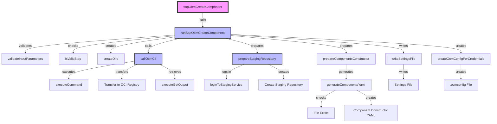

# `sapOcmCreateComponent` Developer Documentation

The Piper step [`sapOcmCreateComponent`](../../../cmd/sapOcmCreateComponent.go) is used for creating an OCM component version (CV) during the "Central Build" process. This component version is stored in a local CTF archive and subsequently transferred to a designated staging repository.

The step can either use an existing component constructor (provided by the Git repository configured for the pipeline) or generate a generic component constructor based on the build context. For example, if the build tool is set to `docker`, the generated component constructor will include resources of type `ociImage`.

---

## Generated Component Constructor

The generated component constructor file (`component-constructor.yaml`) might look like this:

```yaml
components:
  - name: ${componentName}
    version: ${artifactVersion}
    provider:
      name: ${provider}
    sources:
      - name: src
        type: filesystem
        access:
          commit: ${gitCommitID}
          repoUrl: ${gitURL}
          type: gitHub
    resources:
      - name: ${HELM_CHART}
        type: helmChart
        version: ${artifactVersion}
        access:
          helmChart: ${HELM_CHART}
          helmRepository: ${HELM_REPOSITORY}
          type: helm
          version: ${HELM_VERSION}
      - name: ${OCI_NAME_0}
        type: ociImage
        version: ${artifactVersion}
        access:
          imageReference: ${OCI_REFERENCE_0}
          type: ociArtifact
```

---

## Generated Settings File

The step also generates a settings file (`settings.yaml`) that contains placeholders for variables derived from the build context. An example:

```yaml
HELM_CHART: hello-ocm-helm
HELM_REPOSITORY: https://staging.repositories.cloud.sap/stage/repository/371001108081-20241115-095857795-71
HELM_VERSION: 0.0.1-dev
OCI_NAME_0: hello-ocm-helm-image
OCI_REFERENCE_0: 371001098081-20241115-095857693-695.staging.repositories.cloud.sap/hello-ocm-helm:0.0.f67997119082c8ab5e9fa
OCI_VERSION_0: 0.0.1-dev-20241115095822+9eb702808a932e8bf12f67997119082c8ab5e9fa
SettingsPath: gen/settings.yaml
artifactVersion: 0.0.1-dev-20241115095822+9eb702808a932e8bf12f67997119082c8ab5e9fa
buildSettingsInfo: '{"kanikoExecute":[{"dockerImage":"gcr.io/kaniko-project/executor:debug"}]}'
componentConstructorPath: gen/component-constructor.yaml
componentName: open-component-model.sap.com/hello-ocm-helm
containerRegistry: 371001098081-20241115-095857693-695.staging.repositories.cloud.sap
containerRegistryURL: https://371001098081-20241115-095857693-695.staging.repositories.cloud.sap
containerRegistryUser: amZGfFy3ODwYrCI
genDir: gen
gitCommitID: eb61b9708035625620a4938680848e274e3c838e
gitOrg: open-component-model
gitRepository: hello-ocm-helm
gitURL: https://github.tools.sap/open-component-model/hello-ocm-helm
helmChartURL: https://staging.repositories.cloud.sap/stage/repository/371001108081-20241115-095857795-71/hello-ocm-helm-0.0.1-dev.tgz
helmRepositoryUsername: amZGfFy3ODwYrCI
imageNameTags:
    - hello-ocm-helm:0.0.1-dev-20241115095822_9eb702808a932e8bf12f67997119082c8ab5e9fa
imageNames:
    - hello-ocm-helm
provider: SAP SE (open-component-model)
stagingGroupID: group-20241115-0958520771-293
```

---

## Value Calculation

If certain values are not explicitly set in the `.pipeline/config.yml`, they are calculated automatically:

| Key             | Value                                                                                                       |
| --------------- | ----------------------------------------------------------------------------------------------------------- |
| `componentName` | `${gitOrg}.sap.com/${gitRepository}`                                                                        |
| `provider`      | `SAP SE (${gitOrg})`                                                                                        |
| `OCI_NAME_0`    | `${gitRepository}-image` (only if a Helm chart is present, which would result in a resources name conflict) |

---

## Generated OCM Configuration

To work with the `ocm-cli`, the step generates an [OCM configuration file](https://ocm.software/docs/examples/credentials-in-an-.ocmconfig-file) (`.ocmconfig`). Example:

```yaml
type: generic.config.ocm.software/v1
configurations:
    - type: credentials.config.ocm.software
      consumers:
        - identity:
            type: OCIRegistry
            hostname: 371001428081-20241115-100146181-797.staging.repositories.cloud.sap
          credentials:
            - type: Credentials
              properties:
                username: ...
                password: ...
        - identity:
            type: OCIRegistry
            hostname: 371001098081-20241115-095857693-695.staging.repositories.cloud.sap
          credentials:
            - type: Credentials
              properties:
                username: ...
                password: ...
        - identity:
            type: HelmChartRepository
            hostname: staging.repositories.cloud.sap
            pathprefix: stage/repository/371001108081-20241115-095857795-71
          credentials:
            - type: Credentials
              properties:
                username: ...
                password: ...
```

---

## OCM-CLI Commands

The following `ocm-cli` commands are executed during the step:

```bash
ocm version # Only executed if `verbose: true`

# create component version and store it in a local CTF archive file using the component-constructor.yaml
ocm add componentversion --create --settings gen/settings.yaml --file gen/ctf gen/component-constructor.yaml

# transfer the CTF archive (and its contained OCM component) to the staging repository
ocm transfer componentversions gen/ctf <staging-repository>.staging.repositories.cloud.sap
# in case of a custom component-constructor.yaml, the command would look like this:
ocm transfer componentversions --disable-uploads gen/ctf <staging-repository>.staging.repositories.cloud.sap
# that will upload 'input's as localblobs as well

# display the local built descriptor of the component version BEFORE transfer
ocm get componentversion -o yaml gen/ctf
# Display the descriptor of the component version AFTER transfer in YAML format
ocm get componentversion -o yaml <staging-repository>.staging.repositories.cloud.sap//<componentName>:<artifactVersion>
```

If issues arise, enable debug mode by setting `verbose: true` in `.pipeline/config.yml` and check the logs for: `sapOcmCreateComponent - running command:`.

---

## Code Structure

The package ([ocm](../ocm/)) contains helper functions for generating OCM-related files such as `component-constructor.yaml`, `.ocmconfig`, and `settings.yaml`. These files are typically constructed as Go structures and then marshalled into YAML.

### original PR

The original [ContinuousDelivery/piper-library PR "add new step: sapOcmCreateComponent"](https://github.wdf.sap.corp/ContinuousDelivery/piper-library/pull/5182) contains a lot of links and references. There you'll find: [piper-stage-config](https://github.tools.sap/project-piper/resources/pull/62), [Azure integration](https://github.tools.sap/project-piper/piper-pipeline-azure/pull/263), [GitHub Actions integration](https://github.tools.sap/project-piper/piper-pipeline-github/pull/189) and the [3rd party support channel](https://github.wdf.sap.corp/ContinuousDelivery/piper-doc/pull/698), etc.

### metadata yaml

Input and output parameters as well as step documentation (which gets published on [piper-doc: sapOcmCreateComponent](https://github.wdf.sap.corp/pages/ContinuousDelivery/piper-doc/steps/sapOcmCreateComponent/)) have to be edited in [sapOcmCreateComponent.yaml](../../../resources/metadata/sapOcmCreateComponent.yaml) and then generated into coding via: `go generate` to [sapOcmCreateComponent_generated.go](../../../cmd/sapOcmCreateComponent_generated.go).

### update the ocm-cli version

Bump the ocm-cli version by switching to a different `- image:` in the [metadata yaml](../../../resources/metadata/sapOcmCreateComponent.yaml#L385) and don't forget to execute `go generate`. Both changed files have to be committed.

There is a [piper-ocm-cli repository](https://github.tools.sap/open-component-model/piper-ocm-cli) available which provides the images with the ocm-cli preinstalled. Pre-built images are hosted on [ghcr.io/open-component-model/piper-ocm-cli](https://ghcr.io/open-component-model/piper-ocm-cli). Mirrored at [ghcr-remote.common.repositories.cloud.sap/open-component-model/piper-ocm-cli](https://common.repositories.cloud.sap/ui/repos/tree/General/ghcr-remote/open-component-model/piper-ocm-cli).

### Key Functions

[sapOcmCreateComponent.go](../../../cmd/sapOcmCreateComponent.go)

* `func sapOcmCreateComponent`: Entry point of the application.
* `func runSapOcmCreateComponent`: Main logic, orchestrates the various steps.
  * `func prepareComponentsConstructor`: Creates or verifies the component-constructor.yaml.
    * `func generateComponentsYaml`: Generates the component-constructor.yaml file if it does not exist.
  * `func writeSettingsFile`: Writes the settings to a YAML file.
  * `func createOcmConfigForCredentials`: Creates the .ocmconfig file with credentials.
  * `func prepareStagingRepository`: Creates a staging repository and logs into the staging service.
  * `func callOcmCli`: Executes the OCM CLI commands to create and transfer the component.
    * `func executeCommand`: Executes the `ocm` command and logs the output.



---

## Building Locally

To build and test the project locally, run the following commands:

```bash
go mod tidy && \
go generate && \
go test ./cmd/ ./pkg/sap/ocm/ && \ # simple go tests
go run gotest.tools/gotestsum@latest -- -cover -tags=unit  ./... && \ # unit tests as in GHA
GOOS=linux GOARCH=amd64 CGO_ENABLED=0 go build -ldflags "-s -w" -o sap-piper # build binary
```

---

## Relevant Git Repositories

Here is an overview of the repositories involved in this project:


* [jenkins-library](https://github.com/SAP/jenkins-library) - The open source library (no OCM content). _Important: This project is no longer accepting contributions._
* [piper-library](https://github.wdf.sap.corp/ContinuousDelivery/piper-library/) - The main repository with all the SAP specific steps and their logic. It contains also the 'runtime' for Jenkins as orchestrator (see *.groovy files, e.g. [sapOcmCreateComponent](../../../vars/sapOcmCreateComponent.groovy)). The single steps are then combined to stages (e.g. [Central Build](../../../vars/sapPiperStageCentralBuild.groovy), where `sapOcmCreateComponent` has been integrated to).
* [piper-doc](https://github.wdf.sap.corp/ContinuousDelivery/piper-doc/) - Contains the documentation of piper, which is NOT automatically rendered from the [metadata](../../../resources/metadata/sapOcmCreateComponent.yaml). E.g. the [3rd Party Support Channels](https://github.wdf.sap.corp/pages/ContinuousDelivery/piper-doc/3rdparty_support/).
* [resources](https://github.tools.sap/project-piper/resources) - Holds the resource files needed for the Piper binary / Piper general purpose pipeline. They are synced into the other repositories. Here we've set currently: `sapOcmCreateComponent: false`, which doesn't run the step per default. Once we're really done with it and can go GA, we should change it to `sapOcmCreateComponent: true`.
* [sap-piper](https://github.tools.sap/project-piper/sap-piper) - Holds releases of the sap-piper binary. Which are pulled by Azure/GHA.
* [piper-pipeline-azure](https://github.tools.sap/project-piper/piper-pipeline-azure/) - Contains Piper's general purpose pipeline for Azure DevOps and is based on [Piper's Azure Task](https://github.tools.sap/project-piper/piper-azure-task). OCM is integrated in [stages/build.yml](https://github.tools.sap/project-piper/piper-pipeline-azure/blob/644bd120d7ce849ff912d52a53425582d3f9729c/stages/build.yml#L268).
* [piper-pipeline-github](https://github.tools.sap/project-piper/piper-pipeline-github/) - Contains Piper's general purpose pipeline for GitHub Actions and is based on [Piper's GitHub Action](https://github.com/SAP/project-piper-action). OCM is integrated in [.github/workflows/build.yml](https://github.tools.sap/project-piper/piper-pipeline-github/blob/f6d8fa28d23e280aeb54320cda8deb9a2ac48cd0/.github/workflows/build.yml#L226).

To facilitate development and testing of changes, before those changes are merged into the official repositories above, the repositories above have been forked:

* [Forks on github.wdf.sap.corp (piper-library, piper-doc)](https://github.wdf.sap.corp/orgs/open-component-model/repositories?q=&type=fork&language=&sort=)
* [Forks on github.tools.sap (sap-piper, piper-pipeline-azure, piper-pipeline-github, piper-resources)](https://github.tools.sap/orgs/open-component-model/repositories?q=&type=fork&language=&sort=)

---

## Local Development and Testing

Due to dependencies on pipeline orchestrators, staging service and vault, running (and debugging) the step locally is not feasible. Therefore, the suggested procedure is the following:

1. Do the changes in the relevant forked repositories mentioned above. Most of the time it is enough to change the forked `piper-library`.
2. Write unit tests for the changes.
3. Once the changes are merged into the forked repository, manually trigger the build of a [Jenkins-based integration test pipeline](https://btplm.jaas-gcp.cloud.sap.corp).
4. Check the pipeline logs and the build results.

An example of how a `Jenkins` pipeline can be configured to use the forked piper library can be found [here](https://github.tools.sap/open-component-model/hello-ocm-jenkins/blob/ocm-piper-fork/Jenkinsfile).

For testing with [Azure DevOps](https://dev.azure.com/hyperspace-pipelines-2/open-component-model/_build) and [GitHub Actions](https://github.tools.sap/open-component-model/hello-ocm-gha/actions/workflows/sap-piper-workflow.yml) a few of additional steps have to be done:

1. Build the `sap-piper` binary, containing your changes, locally, as described in the [Building Locally](#building-locally) section.
2. Manually create a new release in the [forked `sap-piper` repository](https://github.tools.sap/open-component-model/sap-piper/releases).
    * Upload the built binary to the release.
    * Tag the release as `latest`.
3. Trigger the pipeline of either [`hello-ocm-azure`](https://dev.azure.com/hyperspace-pipelines-2/open-component-model/_build?definitionId=1054) or [`hello-ocm-gha`](https://github.tools.sap/open-component-model/hello-ocm-gha/actions/workflows/sap-piper-workflow.yml).
4. Check the pipeline logs and the build results.

Examples of how an Azure DevOps or a GitHub Actions pipeline can be configured to use the forked piper library can be found [here](https://github.tools.sap/open-component-model/hello-ocm-azure/blob/ocm-piper-fork/azure-pipelines.yml#L11) and [here](https://github.tools.sap/open-component-model/hello-ocm-gha/blob/open-component-model/.github/workflows/sap-piper-workflow.yml#L12) respectively.

The full list of integration test repositories can be found [here](https://github.tools.sap/search?q=topic%3Asapocmcreatecomponent-test&type=Repositories), though the ones for `*-java` and `*-node` are not used at the moment.

---

## Merging Changes to Official Repositories

Once the changes are sufficiently tested, a pull request can be created against the official repositories. Btw., if the pull requests only touches the `sapOcmCreateComponent` step, no approval from the `piper-library` team is needed. A member of the OCM team can merge the PR. See also [CODEOWNERS](https://github.wdf.sap.corp/ContinuousDelivery/piper-library/blob/master/.github/CODEOWNERS#L135).

---

## Dependency: `sapCallStagingService`

The step depends on [Staging-Service](https://github.wdf.sap.corp/pages/Repository-services/staging-service/) to create a new repository in the staging group for storing the created component version. During the `Promote` stage `sapCallStagingService` is executed again and uses `ocm transfer` to promote the component version from staging to <https://common.repositories.cloud.sap/artifactory/deploy-releases-hyperspace-ocm/>. In case the CV contains resources which have been created also during this build (e.g. images/helm-charts), the staging-service team leverages the OCM uploaders to also promote those artifacts to the correct repositories (<https://common.repositories.cloud.sap/artifactory/deploy-releases-hyperspace-docker/> / <https://common.repositories.cloud.sap/artifactory/deploy-releases-hyperspace-helm/>).

Repository: <https://github.wdf.sap.corp/Staging-service/promote-ocm> (private! :-( )
Contacts: [Deyan Kurtev](https://github.wdf.sap.corp/i324945), [Blagovest Kabov](https://github.wdf.sap.corp/I583513)

We do have a manually created clone of the staging service repository in: [github.wdf.sap.corp/open-component-model/promote-ocm](https://github.wdf.sap.corp/open-component-model/promote-ocm?tab=readme-ov-file#staging-servicepromote-ocm)
which is enriched by a special JUnit test, which actually doesn't really test something, but just prints the ocm-cli command how the staging-service would call the `ocm transfer` command.

### [Private staging-tenant](https://github.wdf.sap.corp/pages/Repository-services/staging-service/concept/tenant/#private-tenant)

Whenever someone creates a new pipeline via hyperspace in our [product](https://portal.hyperspace.tools.sap/projects/open-component-model/overview), the default profile will be: `group-6133-default`. That profile is only available on the official tenantId: `hyperspace`. Right now (2025-Q1), the staging service doesn't support OCM on that. Means the promote from staging to production, will fail (at least for component versions).

For testing and development purposes, we do have our own private staging tenant, which provides the profile: `ocmpiper`. In order to switch the staging tenant to be used by a pipeline, you have to do two things:

1. Ensure that the credentials for the tenant are correctly stored in Vault.

    ```json
    {
    "password": "********",
    "tenantId": "ocmpiper",
    "tenantSecret": "****",
    "username": "ocmpiper"
    }
    ```

   Be aware that piper has some builtin Vault search paths:
   1. `$(vaultPath)/staging-service` # not used in our case
   2. `$(vaultBasePath)/$(vaultPipelineName)/staging-service` # might be setup for some `hello-ocm-*` projects
      e.g. _PIPELINE-GROUP-6133/PIPELINE-32875/staging-service_
   3. `$(vaultBasePath)/GROUP-SECRETS/staging-service` # default fall back
      e.g. _PIPELINE-GROUP-6133/GROUP-SECRETS/staging-service_

2. Switch the profile in your `.pipeline/config.yml`

    ```yaml
      sapCallStagingService:
        profile: ocmpiper # group-6133-default / ocmpiper
    ```

compared:

| Tenant                            | `hyperspace`                                                                                                        | `ocmpiper`                                                                                                    |
| --------------------------------- | ------------------------------------------------------------------------------------------------------------------- | ------------------------------------------------------------------------------------------------------------- |
| Vault: **staging-service**        | `tenantId: hyperspace`<br>`username: group-6133`                                                                    | `tenantId: ocmpiper`<br>`username: ocmpiper`                                                                  |
| piper: **.pipeline/config.yml**   | sapCallStagingService: `profile: group-6133-default`                                                                | sapCallStagingService: `profile: ocmpiper`                                                                    |
| **common.repositories.cloud.sap** | [deploy-releases-hyperspace-ocm](https://common.repositories.cloud.sap/artifactory/deploy-releases-hyperspace-ocm/) | [ocm-piper-docker](https://common.repositories.cloud.sap/artifactory/ocm-piper-docker/component-descriptors/) |

#### [Rotate User Password](https://github.wdf.sap.corp/pages/Repository-services/staging-service/howto/rotate_user_password/)

We have a [rotate-staging-service](rotate-staging-service.sh) script, which helps you to rotate the password for the tenant. Just grab the current credentials from Vault and store them in [a json file](../../../gen/staging-service.json), run the script and replace the credentials with the updated one from your json.

---

## See Also

* [Getting Started with Hyperspace](https://sap.sharepoint.com/sites/124706#getting-started)
* [Hyperspace Onboarding](https://onboarding.hyperspace.tools.sap/pipelines)
* Secrets in Vault: [Hyperspace Onboarding](https://onboarding.hyperspace.tools.sap/pipelines) -> Select your pipeline -> `Open secrets in Vault`
* [Hyperspace Portal](https://portal.hyperspace.tools.sap/home)
* [Piper End User Documentation](https://github.wdf.sap.corp/pages/ContinuousDelivery/piper-doc/)
* [Piper Developer Documentation](https://github.wdf.sap.corp/ContinuousDelivery/piper-library/blob/master/DEVELOPMENT.md)
* [#sap-piper-users](https://sap.enterprise.slack.com/archives/C92KW1H55)
