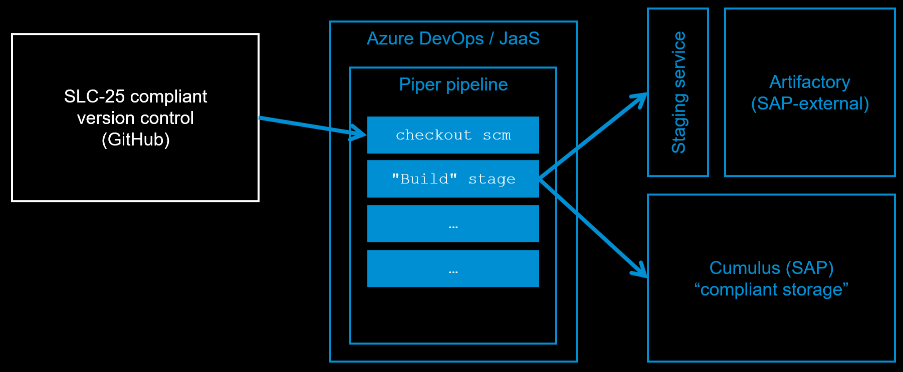
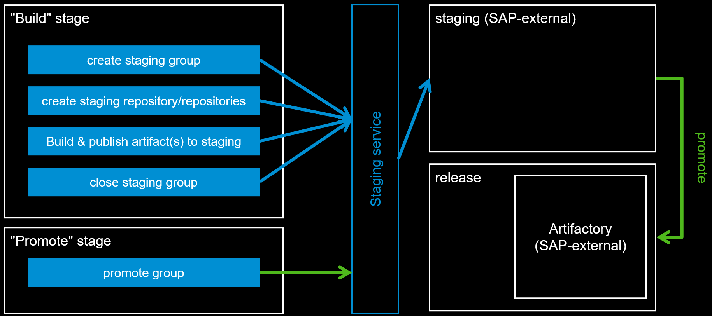

# Piper Native Build on JaaS/Azure/GitHub Actions

The build done by Piper's ["Build" stage](../stages/gpp/build.md) uses the [sapCallStagingService](../steps/sapCallStagingService.md) Piper step to implement the stage & promote pattern. The build result will be stored in the [SAP Internet Facing Common Repository - Artifactory](https://pages.github.tools.sap/Common-Repository/Artifactory-Internet-Facing/index.html) for productive artifacts.

The Piper build enforces certain build settings and also creates transparency about build options which are then stored inside Cumulus where they can be finally evaluated.

## Supported CI/CD orchestrators

* Jenkins via Jenkins-as-a-Service (JaaS)

  !!! warning "[SLC-29](https://wiki.one.int.sap/wiki/display/pssl/SLC-29) compliance is not ensured for Piper on self-hosted Jenkins."
      Using the Piper Native Build on any other Jenkins instance, not provided by "Jenkins-as-a-Service" (JaaS), does not ensure [SLC-29 - Productive Build Pipeline](https://wiki.one.int.sap/wiki/display/pssl/SLC-29) compliance.

* Azure DevOps
* GitHub Actions (using SOLINAS/SUGAR runners)

## Supported build tools

Currently, the following build tools (parameter `buildTool`) are supported and are [SLC-29 compliant](https://wiki.wdf.sap.corp/wiki/x/wgrnOw):

* `docker` (using `kanikoExecute` or `cnbBuild`)
* `maven`
* `npm`
* `mta`
* `golang`
* `gradle`
* `python`

## Build process

### Overview

As a part of Piper Native Build on JasS/Azure , all artifact(s) will be published to a [staging repository](https://github.wdf.sap.corp/pages/Repository-services/staging-service/) when using the Piper build stage.

As a part of compliance, Bill of Material (BOM) xml using [CycloneDX](https://cyclonedx.org/) will always be generated.

Due to the above points, `publish` and `createBOM` parameters are defaulted to `true` in the individual build step(s). If you wish to override then please set `createBOM` and/or `publish` to `false` at the step level, e.g.:

```yaml
golangBuild:
  createBOM: false
  publish: false
```



### Stage/promote details



### Pull-request voting

 Piper aims to run "Build" stage with certain conditions in every Pull request so that the same build and staging flow as the `main` branch is executed. Please see below for orchestrator specific information<br>

 Example of certain conditions - <br>
 `sapCumulusUpload` step is not run and no information is uploaded to Cumulus.
 `imagePushToRegistry` step which will not be run to avoid an image deployment for every Pull-request

!!! tip ""

    === "Jenkins"

        We recommend to use the new option `nativeVoting` in order to use the same build & staging flow as for the build of your `main` branch:

        ```yaml
        general:
          nativeBuild: true
          nativeVoting: true
        ```

        With that the "Pull-request voting" stage of the general purpose pipeline will no longer be executed and no dedicated configuration is required.
        Instead, the "Build" stage is executed with certain conditions as mentioned in the example above.

    === "Azure DevOps"

        No special configuration is required.

        By default the "Build" stage is executed with certain conditions as mentioned in the example above.

    === "GitHub Actions"

        No special configuration is required.

        By default the "Build" stage is executed with certain conditions as mentioned in the example above.

### Docker builds

By default, if you configure `buildTool: docker` in your `.pipeline/config.yaml` file, the Piper native build will create an OCI image using the [kanikoExecute](../steps/kanikoExecute.md) step.

#### Cloud Native Buildpacks

!!! note "Cloud Native Buildpack support is *beta*"
    While the `cnbBuild` step works and the images produced are compliant and hence can be used productively, there might be some missing features and we are looking forward to your feedback, which you can leave in the [slack channel](https://sap-btp.slack.com/archives/C02TGADMF1R).

You can set the following in your `.pipeline/config.yml` file, in order to create an OCI image with the [Cloud Native Buildpacks](https://buildpacks.io/), using the [cnbBuild](../steps/cnbBuild.md) step:

```yaml
general:
  buildTool: docker
stages:
  'Build':
    cnbBuild: true
```

!!! note "SLC-29 Compliance"
    You can get a list of approved build images at the [wiki page](https://wiki.wdf.sap.corp/wiki/pages/viewpage.action?pageId=2650697023).

### Building multiple artifacts

So far the Piper native build supports creation of **one artifact only** in an end to end fashion.

Building multiple artifacts like e.g. one jar plus a container and building multiple containers is on the roadmap but not yet possible end to end, i.e. with full support in the "general purpose pipeline" also for follow-up tasks like security scanning, compliance checks, etc.

As a first step, the Piper native build supports creation of an OCI image in addition to the artifacts produced by the configured build tool, using either the `cnbBuild` or `kanikoExecute` steps. You can activate creation of an image with `kanikoExecute` by setting the following in your `.pipeline/config.yml` file:

```yaml
stages:
  'Build':
    kanikoExecute: true
```

!!! note "Multi-artifacts build using Cloud Native Buildpacks"
    At the moment the `cnbBuild` can be used in combination with these build tools: `npm`, `maven` and `mta` in order to produce multiple artifacts in the Piper native build.

You can configure it as follows:

```yaml
stages:
  'Build':
    cnbBuild: true
```

## Known restrictions

* Build tools as per list above
* Only supports [SAP Internet Facing Common Repository - Artifactory](https://pages.github.tools.sap/Common-Repository/Artifactory-Internet-Facing/index.html) and not the [internal Milestone/Release Nexus](https://github.wdf.sap.corp/pages/Nexus/nexus/), thus dedicated download credentials are required.<br />
  Please see details in step [sapDownloadArtifact](../steps/sapDownloadArtifact.md#artifactorytoken)
* For Docker builds we are only able to pass the staging service download credentials to the Kubernetes deployment step (when using `helm`) inside the Acceptance/Performance stages.

## Setting up a new pipeline using the Piper native build

The easiest way to set up a new pipeline using the Piper Native Build is to do it via [Hyperspace Onboarding](https://hyperspace.tools.sap/), using one of the available templates, for example:

* Java [^1]
* Node.js [^1]
* Java Docker
* Node.js Docker
* Java CAP
* Node.js CAP
* Backend+UI CAP
* Go Docker
* Gradle Docker

[^1]: supported by <a href="https://pages.github.tools.sap/hyperspace/academy/pavedroad/BTP_DwC"></a>

!!! note "Hyperspace Onboarding templates help you stay compliant"

    The Hyperspace Onboarding templates contain the necessary tools you need per build technology to help you stay compliant to SAP's product standards, such as security and licencing tools.

While setting-up your new pipeline, Hyperspace Onboarding takes care of all the pre-requisites needed to use the Piper native build out of the box.

## Moving your existing pipelines to use the Piper native build

In this section you can find out what you need to do, if you already have your pipelines all set up and you would like to use the Piper native build.

If you have a custom pipeline configuration, you can activate the Piper native build by setting the following configuration in your `.pipeline/config.yml` file:

```yaml
general:
  nativeBuild: true
  ...
```

For your build to be SLC-29 compliant, you need to go to [Hyperspace Onboarding](https://hyperspace.tools.sap/pipelines) and follow the documentation to [use the Piper Native Build](https://hyperspace.tools.sap/docs/features_and_use_cases/use_cases/pipeline-extensible/custom-build.html#use-the-piper-native-build). You will get:

* Access to the Cumulus storage to upload compliance relevant information of the build. You can then follow the [store compliance artifacts documentation](https://hyperspace.tools.sap/docs/features_and_use_cases/use_cases/pipeline-extensible/custom-build.html#store-compliance-artifacts) to learn how you can use it in your pipeline.
* Access to the Staging Service, also necessary for compliance reasons. If you have a custom pipeline configuration, you will need to adapt it as described in the [Staging Service documentation](https://hyperspace.tools.sap/docs/features_and_use_cases/connected_tools/staging-service.html) in Hyperspace Onboarding
* The option for the Piper native build will also be enabled.

### Migration of existing xmake-Configuration

This section describes how to switch from an xMake to a Piper native build.

#### Migration of existing xmake-Configuration for mta builds

When migrating your build and not using xmake anymore, you may remove any xmake-relevant config like `xMakeNovaCredentialsId`, `nextGenXMake`, `xMakeBuildQuality` and similar.

In addition, the mtar-group ID previously configured in `.xmake.cfg` via

```properties
[buildplugin]
mtar-group=com.sap.foo
```

must be configured in your `.pipeline/config.yml` file  and also change the `buildType`from xMakePromote to stage:

```yaml
steps:
  mtaBuild:
    mtarGroup: 'com.sap.foo'

  executeBuild:
    buildType: stage
```
