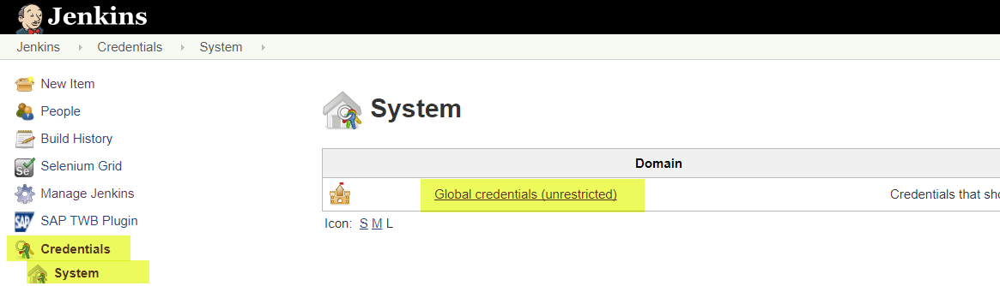
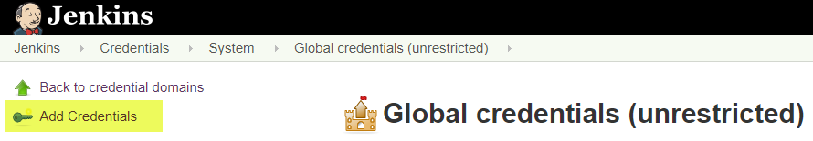
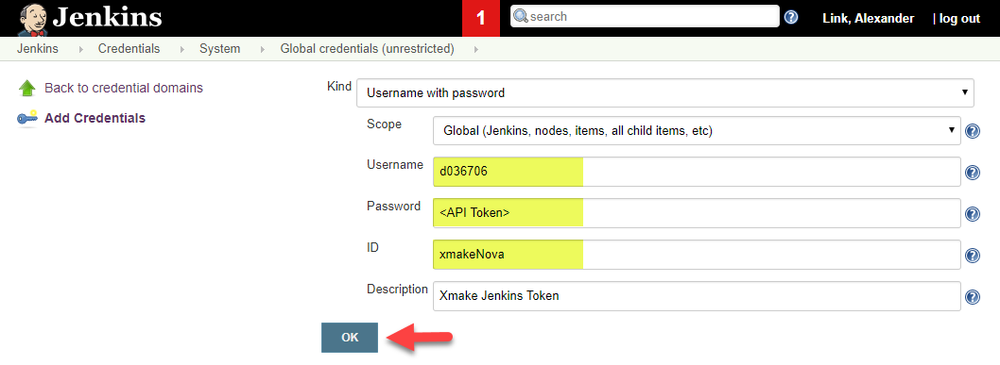

# Piper delegates build to xMake (JaaS only)

!!! note "Piper native build on JaaS/Azure preferred"

    Before using the xMake build, check if the [Piper native build on JaaS/Azure](native.md) would work for you.

## Prerequisites

### Build service

The central xmake build service needs to be activated (in order to get a central job) and configured before successfully executing it. For that see the documentation of ([Central xmake Build Service](https://github.wdf.sap.corp/pages/xmake-ci/User-Guide/Setting_up_a_Build/Setting_up_a_Build/#step-2-create-and-configure-your-build)).

!!! danger "GitHub projects are treated as first class citizens in Piper"
    SAP Cloud Platform Engineering Services promotes GitHub as default offering for Continuous Delivery.<br />Therefore Engineering Services does not supported git/gerrit systems for Piper.<br />Concrete limitation is that a deployPackage (containing for example tests and check results) can only be created for GitHub-based projects. For projects using Gerrit this is not possible.

    Since this pipeline step relies on xMake to provide the results of tests/checks running during the central build it cannot be used for Gerrit-based projects out of the box.<br />There are project using Git/Gerrit though. Please reach out to the Piper through Stack@SAP with the tag `piper`, if you have the need to use Git/Gerrit.

#### Configuration

!!! warning
    For **xmake-nova** the config.yml inside the *config/services* branch needs to be located at: `production-services/build-service-nova/config.yml`.<br>
    For **xmake-dev** the path for the config.yml stays as documented:  `production-services/build-service/config.yml`

The following attributes are important in the build-service configuration (*config.yml*) since the pipeline templates rely on the created deploy package (`prepareDeployPackage: true`) and we use the stage-promote pattern for builds (`milestonestaging: true`):

```yml
attributes:
  prepareDeployPackage: true
  milestonestaging: true
  releasestaging: true
```

!!! note "Node.js builds via xMake"
    You find details about the xMake node plugin on the respective [xmake-node-plugin GitHub page](https://github.wdf.sap.corp/dtxmake/xmake-node-plugin).

    Please always use parameter `publish_npm=true`.

!!! note "Mta builds via xMake"
    You find details about the xMake mta plugin on the respective [MTA shared xmake buildplugin page](https://github.wdf.sap.corp/dtxmake/xmake-mta-plugin)

    If you want to exclude a large mtar from the deployPackage you can set `bundle=false`. For details, please see [MTA shared xmake buildplugin page](https://github.wdf.sap.corp/dtxmake/xmake-mta-plugin).

#### Activation

You need to activate the build service on your repository as [described in the xMake documentation](https://github.wdf.sap.corp/pages/xmake-ci/User-Guide/Setting_up_a_Build/Create_a_Github_project/).

- For **xmake-nova** you have to activate the 'Central Build Service (xmake-nova)' service.
- For **xmake-dev** you have to activate the 'Central Build Service (xmake-dev)' service

### Release builds directly from master branch

For 'Release' builds an alignment with non-ABAP assembly team is required.

Details can be found on the [NAAS Wiki](https://wiki.wdf.sap.corp/wiki/x/xp03cQ).

In order to use this option see [configuration section below](#pipeline-configuration).

### Parameterized Remote Trigger Plugin

The `executeBuild` step is using the [Parameterized Remote Trigger Plugin](https://github.wdf.sap.corp/sap-jenkins-plugins/Parameterized-Remote-Trigger-plugin) (SAP version) to trigger remote Jenkins jobs on ***xmake***. It is pre-configured. However, you need to create specific Jenkins Credentials with a pair of ***user-id*** and ***[Jenkins API token](#jenkins-api-token)*** on your Jenkins instance to successfully trigger your job.

- If you are using the "Central Build Service ([xmake-nova](https://xmake-nova.wdf.sap.corp/))" you have to create a credential with the ID `xmakeNova`
- If you are using the "Central Build Service ([xmake-dev](https://xmake-dev.wdf.sap.corp:8443/))" you have to create a Credential with the ID `xmakeDev`

<a href="https://pages.github.tools.sap/hyperspace/academy/pavedroad/BTP_DwC"></a>

#### Using a technical user for xMake

If you prefer to use a technical user instead of a named user, you need a ```GLOBAL``` domain user. Read the [Set up an IT Service Account](https://hyperspace.tools.sap/docs/features_and_use_cases/how_tos/technical-account/) documentation to learn how to create such a user.

<!-- This link in used in the Hyperspace Onboarding UI, so if you change it please let the team know -->
#### Jenkins API Token

Please follow [xMake Jenkins Token](https://github.wdf.sap.corp/pages/xmake-ci/User-Guide/Live_Site/xmake_News/Jenkins_Token/)

#### Create Credentials

- Navigate to `Credentials` > `System` > click `Global Credentials`
  [](../images/remote_trigger_prepare_credential01.png)
- Click `Add Credentials`
  [](../images/remote_trigger_prepare_credential02.png)
- Select Kind "Username with Password" (although we use a token)

  - Enter your SAP user ID as Username
  - Enter the API Token identified as described in the [section above](#jenkins-api-token)
  - The ID has to be `xmakeNova` for xmake-nova and `xmakeDev` for xmake-dev.
  [](../images/remote_trigger_prepare_credential03.png)

#### Enable your user

If you are using a [technical user](#using-a-technical-user-for-xmake), you need to enable the user in the ```config/services``` branch of your repo using the [addUsers](https://github.wdf.sap.corp/pages/xmake-ci/User-Guide/Setting_up_a_Build/Configure_Github_Builds/#configure-your-builds) feature of xMake ([example config](https://github.wdf.sap.corp/FSDM/FSDM-Extension-Tool/blob/config/services/production-services/build-service-nova/config.yml#L6)).

If you are using a named user that is a committer to the repo, this step is not necessary.

## Pipeline configuration

Configure the build quality. For final customer build quality 'Release" is required.

For realistic testing before initial delivery 'Milestone' is sufficient.

!!! note "Option: Release builds"

    You need to maintain following information in the **config.yml of the build-service**:

    ```yml
    branches:
      - Branch: master
        type: GITHUB_REL

    attributes:
      prepareDeployPackage: true
      finalAssembly_restrictedPromotion: false
      finalAssembly_customerRelease: true
      finalAssembly_internalRelease: false
      releasestaging: true

    ```

    Then you have to activate the build service via [Project Portal](https://projectportal.int.sap.eu2.hana.ondemand.com/), see also [configuration description above](#configuration).

## Usage of pipeline step for xMakeStage

Details:

- The build step returns a property file which is read into a property variable and can be used later.
- The parameters `gitUserName` and `gitUserEMail` allow to overwrite the global git settings available on your Jenkins server
- The parameter `artifactVersion` is only relevant for `xMakeStage` builds in Release quality. It will be used for the Git tag written to the release fork repository.
- The parameter `xMakeJobParameters` can be used to supply additional xMake configuration options that are actually forwarded to `triggerXMakeremoteJob(...)`. `MODE` and `TREEISH` will be fully controlled by the pipeline though.

    This is for example done for retrieving the project archive (containing build result, test results, ...) as well as the repository Id which is required for a later promote step.

### Usage of pipeline step for xMakePromote

```groovy
executeBuild (script: this, buildType: 'xMakePromote')
```

Details:

- After the xMake stage build the staging repository id is recorded
- The staging repository  is passed to the xMake promote step

## Migration from xmake-dev to xmake-nova

Since central `xmake-dev` build landscape exceeded its limits and was not scalable anymore, Engineering Services Production colleagues introduced, in addition, a new `xmake-nova` landscape based on a multi master concept.

!!! warning "More information"
    Xmake-nova supports only linuxx86_64, linuxaarch64, docker_rhel, dockerrun, dockerbuild_aarch64, dockerrun_aarch64. Everything required for the piper-library is already supported (Stage/Promote and Linux platform).

    More information can be found in the [xmake documentation](https://github.wdf.sap.corp/pages/xmake-ci/User-Guide/Live_Site/xmake_News/xmake_dev_migration_to_xmake_nova/).

This section describes how to migrate an existing Pipeline, which uses xmake-dev, to xmake-nova.

1. Copy your the `config.yml` in your `config/services` branch of your GitHub project<br>
   from `production-services/build-service/config.yml`<br>
   to `production-services/build-service-nova/config.yml` ([more information here](#build-service))

2. Activate the 'Central Build Service (xmake-nova)' in Project Portal ([more information here](#activation))

3. Make sure you prepared the required Credentials containing the xmake-nova Jenkins API Token ([more information here](#parameterized-remote-trigger-plugin))

4. The Piper Library is implemented to automatically recognize and prioritize the xmake-nova job. Your Pipeline should now already use xmake-nova. Check in the Pipeline log if really the xmake-nova job has been triggered<sup>1</sup>.

5. You can/should now disable the 'Central Build Service (**xmake-dev**)' in Project Portal.

<br>

<sup>1)</sup> Example Pipeline log triggering xmake-nova job:

!!! note "Job URL"
    The xmake-nova masters typically are called `prod-build<anyNumber>`.

```bash
[Pipeline] triggerRemoteJob
################################################################################################################
  Parameterized Remote Trigger Configuration:
    - job:                     https://prod-build10000.wdf.sap.corp:10000/job/default/job/d036706-piper-test-java-SP-MS-common/
    - auth:                    'Credentials Authentication' as user 'd036706' (Credentials ID 'xmakeNova')
    - parameters:              [MODE=stage, TREEISH=949b95fa09c63d24a31728730804690aa503d803]
    - blockBuildUntilComplete: true
    - connectionRetryLimit:    5
################################################################################################################
Triggering parameterized remote job 'https://prod-build10000.wdf.sap.corp:10000/job/default/job/d036706-piper-test-java-SP-MS-common/'
```
