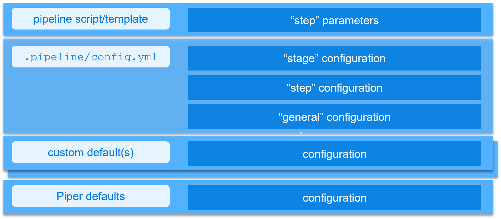

# Configuration

Configuration is done via a yml-file, located at `.pipeline/config.yml`. This file should be present in every branch for which you want to use piper.

!!! note "Do not mix up with xMake configuration (Jenkins only)"
    The Piper configuration file is different from the xMake configuration:

    * Piper configuration is located in `.pipeline/config.yml` in your **main branch** and defines the overall pipeline configuration as well as the configuration of individual steps and stages in the pipeline.
    * xMake configuration is located in the **config/services** branch and solely defines the configuration of the central build. You find details about this in the documentation of the [executeBuild step](steps/executeBuild.md).

Your configuration inherits from the default configuration located at [resources repository](https://github.tools.sap/project-piper/resources/tree/main/gen). For each orchestrator (and instance) there is a default file.

!!! caution "Adding custom parameters"
    Please note that adding custom parameters to the configuration is at your own risk.
    We may introduce new parameters at any time which may clash with your custom parameters.

Configuration of the Piper library steps as well the Piper ready-made pipelines can be done in a hierarchical manner.

1. Directly passed step parameters will always take precedence over other configuration values and defaults.
2. Stage configuration parameters define a stage dependent set of parameters (e.g. deployment options for the `Acceptance` stage).
3. Step configuration defines how steps behave in general (e.g. step `artifactPrepareVersion`).
4. General configuration parameters define parameters which are available across step and stage boundaries.
5. Default configuration comes with the Piper step library and is always available when you use the Piper ready-made pipeline or at least reuse the Init Stage.



## Access to configuration from custom pipeline scripts/templates

!!! tip ""

    === "Jenkins"

        Configuration is loaded into `commonPipelineEnvironment` during step [setupPipelineEnvironment](steps/setupPipelineEnvironment.md).

        You can access the configuration using following call:

        ```groovy
        // retrieve configuration for a dedicated step within a stage
        def config = script.commonPipelineEnvironment.getStepConfiguration('<step name>', '<stage name>')

        // retrieve a step configuration parameter
        def stepConfigParam = config.stepConfigParam
        ```

    === "Azure DevOps"

       Configuration is loaded & evaluated by all steps individually.

       You can access configuration using following call:

       ```yaml
          - task: piper@1
            inputs:
              stepName: getConfig
              flags: "--stageConfig --outputFile stage-config.json"
            displayName: Read stage configuration
          - task: piper@1
            inputs:
              stepName: getConfig
              flags: "--stepName fortifyExecuteScan --outputFile step-config.json"
            displayName: Read step configuration
       ```

    === "GitHub Actions"

       Configuration is loaded & evaluated by all steps individually.

       You can access configuration using following call:

       ```yml
          - uses: project-piper/piper-github-action@main
            with:
              step-name: getConfig
              flags: "--stageConfig --outputFile stage-config.json"
            displayName: Read stage configuration
          - uses: project-piper/piper-github-action@main
            with:
              step-name: getConfig
              flags: "--stepName fortifyExecuteScan --outputFile step-config.json"
            displayName: Read step configuration
       ```

## Custom Default Configuration Layer

If you have a lot of pipelines to maintain, you may want to centralize some of the configuration.

You can have a central default configuration for projects to maintain these settings for all pipelines at once. You can find a template for an easy setup of a custom default configuration layer [here](https://github.tools.sap/project-piper/custom-default-configuration).

!!! tip ""

    === "Jenkins"

        To use your default configuration you need to:

        * add the Jenkins Groovy library to your Jenkins,
        * load the library in your Jenkinsfiles and
        * call the custom setup step setupWithCustomDefaults within your Pipeline.

        You can find further details [here](https://github.tools.sap/project-piper/custom-default-configuration).

    === "Azure DevOps"

        One or multiple URLs can be passed as `customDefaults` parameter in a pipeline template (typically named `azure-pipelines.yml`).

        * This can be done as string, or for multiple files as multi-line string (in literal style with a `|`).
        * When passing multiple files, they are in an ascending order of importance (i.e. config settings in the 2nd file override those of the 1st file).
        * The configuration file needs to be formatted as explained [here](https://github.tools.sap/project-piper/custom-default-configuration#create-own-configuration).
        * The URL(s) must be in [GitHub's REST API format](https://docs.github.com/en/rest/repos/contents#get-repository-content), using the [GitHub Enterprise endpoint](https://docs.github.com/en/enterprise-server@3.1/rest/enterprise-admin#endpoint-urls).

        Example using one file:

        ```yml
        extends:
          template: sap-piper-pipeline.yml@piper-pipeline-azure

          parameters:
            customDefaults: 'https://github.tools.sap/api/v3/repos/project-piper/azure-demo-cf-mta/contents/.pipeline/custom_defaults.yml'
        ```

        Example using multiple files:

        ```yml
        extends:
          template: sap-piper-pipeline.yml@piper-pipeline-azure

          parameters:
          customDefaults: |
            https://github.tools.sap/api/v3/repos/project-piper/azure-demo-cf-mta/contents/.pipeline/custom_defaults.yml
            https://github.tools.sap/api/v3/repos/project-piper/azure-demo-cf-mta/contents/.pipeline/custom_defaults2.yml
        ```

    === "GitHub Actions"

        One or multiple URLs can be passed as `custom-defaults-paths` input in a workflow that uses the general purpose pipeline template.

        * The value of the input needs to be a string, comma-separated if using multiple defaults files.
        * When passing multiple files, they are in an ascending order of importance (i.e. config settings in the 2nd file override those of the 1st file).
        * The configuration file needs to be formatted as explained [here](https://github.tools.sap/project-piper/custom-default-configuration#create-own-configuration).
        * The URL(s) must be in [GitHub's REST API format](https://docs.github.com/en/rest/repos/contents#get-repository-content), using the [GitHub Enterprise endpoint](https://docs.github.com/en/enterprise-server@3.1/rest/enterprise-admin#endpoint-urls).

        Example:

        ```yml
        jobs:
          piper:
            uses: project-piper/piper-pipeline-github/.github/workflows/sap-piper-workflow.yml@main
            with:
              custom-defaults-paths: 'https://github.tools.sap/api/v3/repos/project-piper/actions-demo-k8s-node/contents/.pipeline/custom_defaults.yml'
            secrets: inherit
        ```
