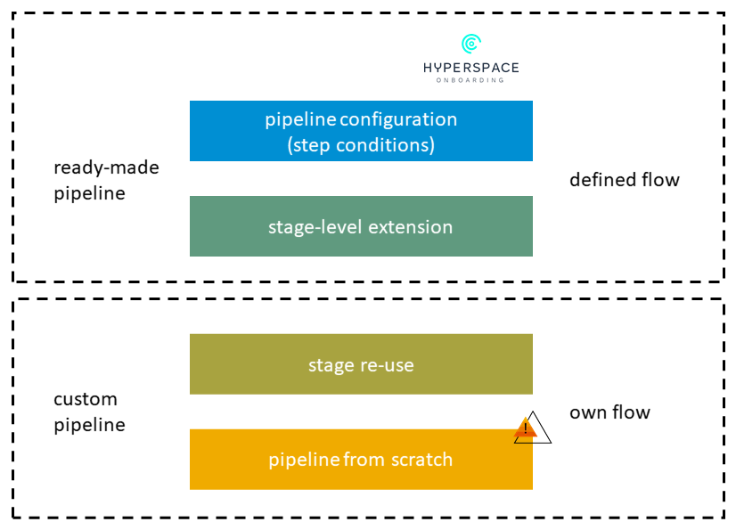

# Extensibility

!!! warning

    If you decide to use extensions, your pipeline will become orchestrator specific.

    **You must then be familiar with the orchestrator technologies. We only provide limited support in such scenarios. Do reach out to us if a certain Piper step doesn't work as expected.**

    Please find overall information on the orchestrator technologies [here](orchestrator_technologies.md).

When using one of the Piper ready-made pipelines, you don't have to write custom pipeline code.
The ready-made pipelines are centrally maintained and can be used with only a small amount of declarative configuration as documented [here](configuration.md).

For the vast majority of _standard_ projects, the features of the ready-made pipelines should be enough to implement [Continuous Delivery](https://martinfowler.com/bliki/ContinuousDelivery.html) with little effort in a best-practice compliant way.
If you miss a feature or discover a bug in one of our pipelines, then reach out to us via our official support channel - ServiceNow. Do check the [Contact & Support](forum.md) page for more details.

In some cases, it's not desirable to include specialized features in the ready-made pipelines.
However, you can still benefit from their qualities, if you address your requirements through an **extension**.
Extensions are custom bits of pipeline coding, which you can use to implement special requirements.

!!! note

    Before building extensions, please make sure that there is no alternative that works better for you.

This page explains extensibility options in project "Piper".
For a high level overview of available options and how to interface with them, see this figure:



!!! tip "Important extensibility notes"

    === "Jenkins"

        **Init stage cannot be extended**<br /><br />
        Please note that the `Init` stage also checks out your current repository including your extensions.<br />
        Therefore, it is not possible to use extensions on this stage.

        **Disable extensions execution**<br /><br />
        If you want to deactivate the extensions, ensure to set the environment variable `PIPER_DISABLE_EXTENSIONS` to `true`.
        As a result the extension files in `.pipeline/extensions/<StageName>.groovy` are no longer considered.

    === "Azure DevOps"

        **Stages with the extensibility option:**<br /><br />

        * acceptance
        * integration
        * performance
        * release

        Background information:

        * https://docs.microsoft.com/en-us/azure/devops/pipelines/process/templates?view=azure-devops
        * https://www.skilledcookie.com/2021/03/18/manipulating-pipelines-with-templates-and-expressions/

    === "GitHub Actions"

        **Stages with the extensibility option:**<br /><br />

        * build
        * acceptance
        * integration
        * performance
        * release
        * post

        Please see [Piper Extensibility](https://github.tools.sap/project-piper/piper-pipeline-github#extensibility ) for additional information.

Options for extensibility, in the order in which we recommend considering them:

- [Extensibility](#extensibility)
  - [1. Extend individual stages](#1-extend-individual-stages)
  - [2. Modified Piper ready-made pipeline](#2-modified-piper-ready-made-pipeline)
    - [Single repository](#single-repository)
    - [Multiple repositories](#multiple-repositories)
    - [How to stay up-to-date](#how-to-stay-up-to-date)
    - [Use orchestrator specific capabilities](#use-orchestrator-specific-capabilities)
  - [3. New pipeline from scratch](#3-new-pipeline-from-scratch)

## 1. Extend individual stages

In this option, you use the centrally maintained pipeline but can change individual stages, if required. <br>
When a stage fails in GHA, respective stages' post extensions are skipped.If you have some steps that you want to run regardless of a failure, please consider using extensions for Post stage in GHA.

!!! tip ""

    === "Jenkins"

        To do so, create a file called `<StageName>.groovy` (for example, `Acceptance.groovy` or `lint.groovy`) in `.pipeline/extensions/` in the source code repository of your application.

        For this, you need to know the technical identifiers for stage names.

        For the general purpose pipeline, you can find them in [the pipeline source file](https://github.com/SAP/jenkins-library/blob/master/vars/piperPipeline.groovy).

        The centrally maintained pipeline checks if such a file exists and if it does, executes it.
        A parameter of type `Map` that contains the following keys is passed to the extension:

        * `script`: Defines the global script environment of the `Jenkinsfile` run. This makes sure that the correct configuration environment can be passed to project "Piper" steps and allows access to the `commonPipelineEnvironment`, for example. When calling a piper step in an extension, the script object has to be passed using `script: params.script`.
        * `originalStage`: Allows you to execute the "original" stage at any place in your script. If omitting a call to `originalStage()`, only your code is executed.
        * `stageName`: Name of the current stage
        * `config`: Configuration of the stage and general config (including all defaults)

    === "Azure DevOps"

        **Following extensibility options exist:**

        * add steps at the beginning of a stage (`<stage>PreSteps` . Exception for Security and IPCompliance stage see example)
        * add steps at the end of a stage (`<stage>PostSteps`. Exception for Security and IPCompliance stage see example)
        * overwrite a stage (`<stage>OverwriteSteps`) (only stage: integration, acceptance, performance and release can be overwritten)

    === "GitHub Actions"

        Piper's general purpose pipeline stages can be extended via [composite actions](https://docs.github.com/en/actions/creating-actions/creating-a-composite-action).

        To enable extensions in Piper's general purpose pipeline, set the `extensibility-enabled` input to `true` in your project's workflow file.
        ```yml
            jobs:
              piper:
                uses: project-piper/piper-pipeline-github/.github/workflows/sap-piper-workflow.yml@main
                secrets: inherit
                with:
                  extensibility-enabled: true
        ```

        An extension consists of a folder containing a composite action (`action.yml`) and, if needed, some additional helper files. The folder name should follow the format `[pre|post]<stage name>`, where `pre` or `post` indicating whether it is a pre-stage or post-stage extension. `<stage name>` should correspond to the name of the stage you intend to extend. Since extensibility is implemented via composite actions, the name of the composite action file must be `action.yml` (or `action.yaml`).

        Extensions can be *local* or *global* (remote), with local extensions taking precedence over global ones. 
        Local extensions should be placed in the `.pipeline/extensions` folder.

        Global extensions, on the other hand, should be located in the root of a (dedicated) repository. This dedicated repository should be hosted on the same GitHub instance as the one where the pipeline runs.To configure Piper to look for global extensions, set the `globalExtensionsRepository` parameter in the general section of your repository's configuration file. This parameter expects a value in the `{owner}/{repository}` format.

        Please see [Piper Extensibility](https://github.tools.sap/project-piper/piper-pipeline-github#extensibility ) for additional information.

??? example "Jenkins: Extension example"

    Here is a simple example for such an extension, which you can use as a starting point:

    ```groovy
    void call(Map params) {
      //access stage name
      echo "Start - Extension for stage: ${params.stageName}"

      //access config
      echo "Current stage config: ${params.config}"

      //execute original stage as defined in the template
      params.originalStage()

      //access overall pipeline script object
      echo "Branch: ${params.script.commonPipelineEnvironment.gitBranch}"

      echo "End - Extension for stage: ${params.stageName}"
    }
    return this
    //Don't forget the `return this`, which is required at the end of _all_ extension scripts.
    This is due to how Groovy loads scripts internally.
    ```

??? example "Jenkins: Practical example"

    For a more practical example, you can use extensions in the general purpose pipeline to add custom linters to your pipeline.

    A linter is a tool that can check the source code for certain stylistic criteria. Many teams choose to use a linter to ensure a common programming style.

    For example, if you want to use [Checkstyle](https://checkstyle.sourceforge.io/) in your codebase, you might use an extension similar to this one in a file called `.pipeline/extensions/Build.groovy` in your project:

    ```groovy
    def call(Map parameters) {

        parameters.originalStage() // Runs the central build stage with built-in linters

        mavenExecute(
            script: parameters.script,
            flags: ['--batch-mode'],
            pomPath: 'application/pom.xml',
            m2Path: s4SdkGlobals.m2Directory,
            goals: ['checkstyle:checkstyle'],
        )

        recordIssues blameDisabled: true,
            enabledForFailure: true,
            aggregatingResults: false,
            tool: checkStyle()
    }

    return this
    ```

    This code snippet has three components, let's see what is happening here:

    Firstly, we run the original stage.
    This builds the application and optionally runs ESLint on JavaScript/TypeScript source files and static checks using PMD and SpotBugs tools as these are standard features of General Purpose Pipeline.

    Secondly, we run the checkstyle maven plugin using the `mavenExecute` Jenkins library step as provided by project "Piper".
    This serves as an example for how flexible you can reuse what project "Piper" already provides in your extension.

    Finally, we use the Jenkins [Warnings NG plugin](https://plugins.jenkins.io/warnings-ng/) and its step `recordIssues` to make the findings visible in the Jenkins user interface.

    This example can be adapted for other linters of your choice.
    Be sure to checkout the _Library steps_ section of this documentation if you want to do this.
    Project "Piper" provides some basic building blocks such as `dockerExecute` and the already mentioned `mavenExecute` which might be helpful.

??? example "Azure Example 1: Adding steps to acceptance stage (pre and post)"

    ```yml
    # Using Piper general purpose pipeline for Azure

    trigger:
      - main

    resources:
      repositories:
      - repository: piper-pipeline-azure
        endpoint: github.tools.sap
        type: githubenterprise
        name: project-piper/piper-pipeline-azure

    extends:
      template: sap-piper-pipeline.yml@piper-pipeline-azure
      parameters:
        acceptancePreSteps:
        - script: echo "Hello World 1"
        - script: echo "Hello World 2"
        acceptancePostSteps:
        - script: echo "Hello World 3"
        - script: echo "Hello World 4"
    ```

??? example "Azure Example 2: Adding steps to security stage, where two jobs runs as a part of the stage : pre and post for SAST and OSS jobs need to be added separately"

    ```yml
    # Using Piper general purpose pipeline for Azure

    trigger:
      - main

    resources:
      repositories:
      - repository: piper-pipeline-azure
        endpoint: github.tools.sap
        type: githubenterprise
        name: project-piper/piper-pipeline-azure

    extends:
      template: sap-piper-pipeline.yml@piper-pipeline-azure
      parameters:
        SASTPreSteps:
        - script: echo "Hello World 1"
        - script: echo "Hello World 2"
        SASTPostSteps:
        - script: echo "Hello World 3"
        - script: echo "Hello World 4"
        OSSPreSteps:
        - script: echo "Hello World 3"
        - script: echo "Hello World 4"
        OSSPostSteps:
        - script: echo "Hello World 3"
        - script: echo "Hello World 4"
    ```

??? example "Azure Example 3: Adding steps to IPScanPPMS stage, where two jobs runs as a part of the stage : pre and post for IPScan and PPMS jobs need to be added separately"

    ```yml
    # Using Piper general purpose pipeline for Azure

    trigger:
      - main

    resources:
      repositories:
      - repository: piper-pipeline-azure
        endpoint: github.tools.sap
        type: githubenterprise
        name: project-piper/piper-pipeline-azure

    extends:
      template: sap-piper-pipeline.yml@piper-pipeline-azure
      parameters:
        ipScanPreSteps:
        - script: echo "Hello World 1"
        - script: echo "Hello World 2"
        ipScanPostSteps:
        - script: echo "Hello World 3"
        - script: echo "Hello World 4"
        PPMSPreSteps:
        - script: echo "Hello World 3"
        - script: echo "Hello World 4"
        PPMSPostSteps:
        - script: echo "Hello World 3"
        - script: echo "Hello World 4"
    ```

??? example "Azure Example 4: Overwriting release stage"

    ```yml
    # Using Piper general purpose pipeline for Azure

    trigger:
      - main

    resources:
      repositories:
      - repository: piper-pipeline-azure
        endpoint: github.tools.sap
        type: githubenterprise
        name: project-piper/piper-pipeline-azure

    extends:
      template: sap-piper-pipeline.yml@piper-pipeline-azure
      parameters:
        releaseOverwriteSteps:
        - script: echo "Hello World 1"
        - script: echo "Hello World 2"
    ```

??? example "Azure Example 5: Adding steps to integration stage using a template within the code repository"

    ```yml
    # Using Piper general purpose pipeline for Azure

    trigger:
      - main

    resources:
      repositories:
      - repository: piper-pipeline-azure
        endpoint: github.tools.sap
        type: githubenterprise
        name: project-piper/piper-pipeline-azure

    extends:
      template: sap-piper-pipeline.yml@piper-pipeline-azure
      parameters:
        integrationPreSteps:
        - template: .pipeline/extensions/integration.yml
    ```

??? example "Azure Example 6: Adding steps to integration stage using a central template"

    ```yml
    # Using Piper general purpose pipeline for Azure

    trigger:
      - main

    resources:
      repositories:
      - repository: piper-pipeline-azure
        endpoint: github.tools.sap
        type: githubenterprise
        name: project-piper/piper-pipeline-azure
      - repository: azure-demo-global-extension
        endpoint: github.tools.sap
        type: githubenterprise
        name: project-piper/azure-demo-global-extension

    extends:
      template: sap-piper-pipeline.yml@piper-pipeline-azure
      parameters:
        integrationPreSteps:
        - template: /extensions/integration.yml@azure-demo-global-extension
    ```

??? example "GitHub Actions: Extending a stage via Local extension"

    This extension is designed to execute a shell script using the shellExecute Piper step before the Build stage begins.

    - Location: `.pipeline/extensions/preBuild`
    - Folder Name: `preBuild`
    - Main Components:
      - **action.yml**: The composite action file defining the execution of the shell script.
      - **script.sh**: The shell script to be executed.

    Ensure the extension is structured as follows:

    ```txt
    .
    └── .pipeline
        └── extensions
            └── preBuild
                ├── action.yml
                └── script.sh
    ```

    action.yml:

    ```yaml
    name: PreBuild
    runs:
      using: composite
      steps:
        - name: shellExecute
          uses: SAP/project-piper-action@main
          with:
            step-name: shellExecute
            flags: --sources .pipeline/extensions/preBuild/script.sh
    ```

## 2. Modified Piper ready-made pipeline

This option describes how you can copy and paste one of the centrally maintained pipelines to make changes to it that are not possible otherwise.
For example, you can't change the order of stages and the stages that run in parallel or add new stages to a centrally maintained pipeline. If you do so then we will not be able to actively support you with Pipeline failures unless a piper step is failing.

!!! tip ""

    === "Jenkins"

        A modified Piper ready-made pipeline allows you to have a custom [declarative pipeline based on the syntax Jenkins provides](https://jenkins.io/doc/book/pipeline/syntax/#declarative-pipeline).

    === "Azure DevOps"

        A modified Piper ready-made pipeline allows you to have a custom [Azure DevOps pipeline template](https://docs.microsoft.com/en-us/azure/devops/pipelines/process/templates?view=azure-devops)

    === "GitHub Actions"

        A modified Piper ready made pipeline allows you to have a custom [workflow](https://docs.github.com/en/actions/writing-workflows/workflow-syntax-for-github-actions)

This might be done for an individual repository, or in a separate Git repository so it can be used for multiple projects.

### Single repository

A default Piper ready-made Pipeline loads the pipeline logic including the pipeline stages and executes it. This approach limits the modifiable aspects of the pipeline (e.g. pipeline flow, stages to execute).

If one of your repository uses the Piper ready-made pipeline, the easiest way to do the modification is to copy the pipeline into your orchestrator specific pipeline file (e.g. Jenkinsfile, azure-pipelines.yml).

!!! tip ""

    === "Jenkins"

        The basic structure of your `Jenkinsfile` should be the following:

        ```groovy
        @Library(/* Shared library definition, see below */) _

        call script: this

        void call(parameters) {
          // Your pipeline code based on our ready-made pipelines
        }
        ```

        The actual pipeline code (the `call` method in the listing above) can be found here:

        * [Piper general purpose pipeline](https://github.wdf.sap.corp/ContinuousDelivery/piper-library/blob/master/vars/sapPiperPipeline.groovy)

    === "Azure DevOps"

        ```yml
        trigger:
        - main

        stages:
          # your pipeline code based on our ready-made pipelines
        ```

        The actual pipeline code (Azure pipeline template) can be found here:

        * [Piper general purpose pipeline](https://github.tools.sap/project-piper/piper-pipeline-azure/blob/main/sap-piper-pipeline.yml)

    === "GitHub Actions"

        ```yml
        name: Piper extensible workflow
        on:
          workflow_dispatch:

        jobs:
          # your pipeline code based on our ready made pipelines
        ```

        The actual pipeline code (Github action workflow file) can be found here:
        [Piper general purpose pipeline](https://github.tools.sap/project-piper/piper-pipeline-github/blob/main/.github/workflows/sap-piper-workflow.yml).
        [Link to an example](https://github.tools.sap/project-piper/piper-pipeline-github/blob/main/examples/custom_workflow/extending_pipeline.yml)

### Multiple repositories

If you have multiple repositories that share a similar architecture, it might be desirable to share one modified pipeline amongst them.
Similar to what you can do in an individual orchestrator specific pipeline file (e.g. Jenkinsfile, azure-pipelines.yml), you can copy the pipeline to your own shared library/template and modify it.

To do this, create a new Git repository in GitHub.

!!! tip ""

    === "Jenkins"

        Your individual pipeline must be compliant to [how Jenkins shared libraries are built](https://jenkins.io/doc/book/pipeline/shared-libraries/).
        In a nutshell, this means that you need a `vars` directory inside which you can place a copy of your preferred pipeline.

        A minimal example of such a library could have the following directory structure:

        ```text
        ./vars/myCustomPipeline.groovy
        ./README.md
        ```

        `myCustomPipeline.groovy` contains the modified pipeline code of the [general purpose pipeline](https://github.com/SAP/jenkins-library/blob/master/vars/piperPipeline.groovy).

        !!! note
            The name of your custom pipeline _must_ differ from the other pipelines provided by project "Piper" because Jenkins requires names across multiple libraries to be unique.

        This library must be placed in a Git repository, which is available for Jenkins and must be configured in Jenkins [as documented here](https://jenkins.io/doc/book/pipeline/shared-libraries/#using-libraries).

    === "Azure DevOps"

        Please follow the respective [Microsoft Azure DevOps Template documentation](https://docs.microsoft.com/en-us/azure/devops/pipelines/process/templates?view=azure-devops)

    === "GitHub Actions"
        The following links are useful 

        - [Creating a reusable workflow](https://docs.github.com/en/actions/sharing-automations/reusing-workflows#creating-a-reusable-workflow)
        - [Calling a reusable workflow](https://docs.github.com/en/actions/sharing-automations/reusing-workflows#calling-a-reusable-workflow)

        For eg., to call a workflow in the same organization
        ```
          jobs:
            test-job:
              uses: {owner}/{repo}/path/to/reusable workflow/in/different/repository
              secrets:inherit
        ```

        Please take care that regarding passing of secrets among the workflows. Secrets are not automatically passed to reusable workflows as mentioned [here](https://docs.github.com/en/actions/security-for-github-actions/security-guides/using-secrets-in-github-actions#using-secrets-in-a-workflow).
        
        
        Reusable workflow in the same organization as the calling workflow can share secrets using 'secrets:inherit' as shown in the example above.
        More info around secrets [here](https://docs.github.com/en/actions/sharing-automations/reusing-workflows#using-inputs-and-secrets-in-a-reusable-workflow)

??? example "Jenkins example"

    The following screenshot shows an example of the configuration in Jenkins.
    Note that the name (1) must be the same as the one you use in your `Jenkinsfile`.

    

    The `Jenkinsfile` of your individual projects would look similar to the following:

    ```groovy
    @Library(['piper-lib-os','my-own-pipeline']) _

    myCustomPipeline script: this
    ```

??? example "Azure example"

    ```yml
    trigger:
      - main

    resources:
      repositories:
      - repository: our-pipeline-azure
        endpoint: github.tools.sap
        type: githubenterprise
        name: our-project/our-pipeline-azure

    extends:
      template: our-pipeline.yml@our-pipeline-azure
    ```

### How to stay up-to-date

Regardless of which of the above options you choose, one downside of this approach is that your pipeline will be out of sync with the centrally maintained pipelines at some point in time.

!!! attention
    We strongly recommend to **reuse existing stages** and do **as little modifications as possible** to fulfill your requirements.<br />
    Please be aware that stages may have dependencies on each other.<br />

    Your pipeline should treat stages as a black box, the stage implementations are not a published API and may be subject to change at any time.
    The support model would also vary depending on the approach you have followed. We are only responsible for the general purpose template part of the piper library.

### Use orchestrator specific capabilities

If you want to use orchestrator specific capabilities in your extensions, following information will help you:

!!! tip ""

    === "Jenkins"

        [Jenkins pipeline steps reference](https://jenkins.io/doc/pipeline/steps/)

    === "Azure DevOps"

        [Azure pipeline task index](https://docs.microsoft.com/en-us/azure/devops/pipelines/tasks/?view=azure-devops)

    === "GitHub Actions"

        * [Creating a custom composite action](https://docs.github.com/en/actions/sharing-automations/creating-actions/creating-a-composite-action?platform=linux)
         * [Workflow syntax for Github Actions](https://docs.github.com/en/actions/writing-workflows/workflow-syntax-for-github-actions)
        * [Metadata syntax for Github Actions](https://docs.github.com/en/actions/sharing-automations/creating-actions/metadata-syntax-for-github-actions#inputs)

## 3. New pipeline from scratch

!!! danger "Decoupling"
    If you choose this option, you will be decoupled from the innovations provided with project "Piper", unless you reuse stages (as indicated above under [Modified Piper ready-made pipelines](#2-modified-piper-ready-made-pipeline)), for example.

    **We recommend using this only when none of the other provided options suit your use case.**

Since project "Piper" fully builds on orchestrator specific capabilities, you can also go with your own pipeline from scratch in a orchestrator specific file (e.g. `Jenkinsfile`, Azure pipeline yml file).

!!! tip ""

    === "Jenkins"

        [Jenkins Pipeline as Code](https://www.jenkins.io/doc/book/pipeline-as-code/)

    === "Azure DevOps"

        [Azure pipeline basics](https://docs.microsoft.com/en-us/azure/devops/pipelines/get-started/key-pipelines-concepts?view=azure-devops)

    === "GitHub Actions"

        * [Github Actions @ SAP documentation](https://pages.github.tools.sap/github/features-and-usecases/features/actions/start)
        * [SUGAR service Onboarding Documentation](https://wiki.one.int.sap/wiki/display/DevFw/SUGAR#SUGAR-HowToInstallTheGitHubAppAndUseTheService)
        * [Quickstart on Github Actions](https://docs.github.com/en/actions/writing-workflows/quickstart)
