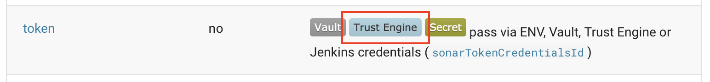

# Pipeline Secrets

The pipeline needs various secrets to authenticate with the different services it is integrating with. There are different ways in which these can be provided to the pipeline step.

!!! note
    The usage of [Vault](#vault) for pipeline secrets is recommended by the [GHA security hardening guide](https://pages.github.tools.sap/github/features-and-usecases/features/actions/security-hardening/#critical-protecting-your-secrets).

## CLI

The simplest way to pass a secret to a step is as simple step parameters on the command line interface:

```sh
piper sonarExecuteScan --token mySecretToken
```

As parameters can also be provided via environment variables, one could also use the following:

```sh
export PIPER_token=mySecretToken
piper sonarExecuteScan
```

!!! note
    Be aware that plain secret parameters cannot be set via `.pipeline/config.yml` as is indicated in a parameters *configuration scope* section in the [steps documentation](../steps/sonarExecuteScan.md/#token).

## Jenkins

??? info "Jenkins only"
    As this is based on a Jenkins feature it is limited to that orchestrator.

Jenkins provides a secret store to [maintain credentials](https://www.jenkins.io/doc/book/using/using-credentials/#configuring-credentials). These credentials can then be used to provide secret (file, username/password, token) to Piper steps.

```groovy
sonarExecuteScan(script: this, sonarTokenCredentialsId: 'jenkinsCredentialID')
```

Also the credential ID could be set inside the `.pipeline/config.yml`.

## Vault

The recommendation is to store secrets in [SAP's Vault system](https://vault.tools.sap/), which will be set up as part of [Hyperspace Onboarding](https://hyperspace.tools.sap/home).
The SAP defaults contain already the correct system url.

Piper supports fetching your pipeline secrets directly from [Vault](https://www.hashicorp.com/products/vault).

Details how to use Vault can be found [here](vault.md).

## Hyperspace System Trust

??? info "Jenkins"
    Hyperspace System Trust on Jenkins is available with an *Jenkins as a Service* instance.

??? info "Azure DevOps"
    Hyperspace System Trust is not yet available on Azure DevOps.

??? info "GitHub Actions"
    Hyperspace System Trust on GitHub Actions is available with [SUGAR runners](https://pages.github.tools.sap/github/features-and-how-tos/features/actions/how-tos/runners/).

With [*Hyperspace System Trust*](https://pages.github.tools.sap/system-trust/) a token can be requested on the fly by the pipeline for a specific service. This is possible by a trust between the orchestrator and the service, that is established using [OIDC](https://openid.net/developers/how-connect-works/).

It is required, that the pipeline is created via the [*Hyperspace Portal*](https://portal.hyperspace.tools.sap/) or *Hyperspace Onboarding* (extensible pipeline). Also the concerned services need to be added to the pipeline in there, so that a link is established between the Hyperspace project and the e.g. Sonar project

!!! note
    It is required, that the secret is not provided in any other way. Therefore a step must neither be provided with the secret via config nor via Vault. This means in Vault there must not be a project or group secret for the service defined!

This way of authentication is currently only available for a limited set of services / steps. Whether it is supported by a step or not can be seen in the [parameters section](../steps/sonarExecuteScan.md/#parameters) of a step.



## Github Automatic token

??? info "GitHub Actions only!"
    The Github Automatic token limited to GitHub Actions Gpp only.

!!!

Piper is providing the possibility to use the [GitHub automatic token](https://docs.github.com/en/actions/security-for-github-actions/security-guides/automatic-token-authentication) for Piper steps which need GitHub personal access token (PAT) on **GitHub Actions**.
This means that it is not necessary to maintain a PAT in Vault for Piper steps which need one on **Piper GitHubActions** and is an alternative to PAT. This will hugely benefit users of Piper steps to reduce the overload of maintaining a PAT in Vault.

Following table show the setails of piper steps and stages enabled to use the GitHub automatic token

| Piper step   | Piper stage  | Automatic GitHub token enabled?  | Additional Info |
|--------------|--------------|----------------------------------|----------------|
| sapPipelineInit | Init | Yes |    |
| artifactPrepareVersion| Build | Yes |   |
| sonarExecuteScan| Build | No | GitHub token not necessary for latest SonarQube servers|
| gitopsUpdateDeployment | Acceptance, Performance, Release | Yes |   |
| kubernetesDeploy | Acceptance, Performance, Release | Yes |   |
| githubPublishRelease | Release | Yes |    |
| sapCollectInsights | Release | Yes |    |
| sapReportPipelineStatus | Release | Yes |   |
| vaultRotateSecretId| Post| No | See note below |

The stage workflows(`init.yml`, `build.yml`, etc.) in Piper are modified to pass the new automatic token.

The automatic token currently doesn't apply for `vaultRotateSecretId` step as GitHub repository secrets cannot be written by the token.
For users of Hyperspace Portal, secrets [are automatically refreshed](https://pages.github.tools.sap/hyperspace/cicd-setup-documentation/managed-services/build/piper.html)

### Can this new token work along with already enabled token from Hyperspace System Trust?

Yes.
The new GitHub Automatic Token is an alternative to Github's Personal Access Token, while the Hyperspace System Trust is currently enabled for requesting tokens for specific services like Cumulus and Sonar.
For eg., If your pipeline contains steps 'sapPipelineInit' and 'sonarExecuteScan',
'sapPipelineInit' -->  the automatic token is used to access github
'sonarExecuteScan' --> Hyperspace System Trust token is used to access Sonar

### How do I use the new GitHub Automatic token in my pipelines

### For new Pipelines via Hyperspace Portal

Nothing to be done. The automatic GitHub token will be used if the PAT is not found in Vault.

### For existing Pipelines

If you wish to use the GitHub Automatic token instead of configuring your PAT in vault , please follow below steps

- Remove secret in Vault, if any at the pipeline or pipeline group level
- Following write permissions to be set in your GitHub Actions workflow which calls Piper as shown below. The below example also shows how one can enable system trust along with the token.

  ```yaml
  name: Piper
  on:
    workflow_dispatch:
  jobs:
    piper:
      uses: project-piper/piper-pipeline-github/.github/workflows/sap-piper-workflow.yml@v1.17.0
      secrets: inherit
      permissions:
        contents: write  # write required for piper to create tags and releases
        id-token: write  # for connections to system-to-system trust
  ```

### For existing Pipelines using extensions

If you want to pass the GitHub Automatic token in your extension to a piper step, please provide the token as a step flag. For eg., your composite action.yml can be something as below to directly call the sapPipelineInit & artifactPrepareVersion step via a local extension. Note that the GitHub Automatic Token needs to be passed as a flag to the correct parameter of respective step

Location: .pipeline/extensions/preAcceptance
File: action.yml

```yaml

name: PreAcceptance
runs:
  using: composite
  steps:
    - name: sapPipelineInit
      uses: SAP/project-piper-action@main
      with:
        step-name: sapPipelineInit
        flags: --githubToken {{ github.token }}
    - name: artifactPrepareVersion
        uses: SAP/project-piper-action@main
        with:
          step-name: artifactPrepareVersion
          docker-image: ${{ env.dockerImage }}
          flags: --username github-actions --password ${{ github.token }}
```

**Note**
The automatic token currently doesn't apply for `vaultRotateSecretId` step as GitHub repository secrets cannot be updated by the token.
For users of Hyperspace Portal, secrets [are automatically refreshed](https://pages.github.tools.sap/hyperspace/cicd-setup-documentation/managed-services/build/piper.html)
