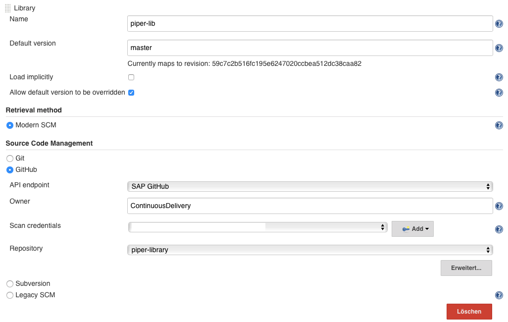

# Library Setup (Jenkins only)

!!! note "No action required for JaaS and Piper-Jenkins-Docker"
    For [Jenkins as a Service instances](https://jenx.int.sap.hana.ondemand.com) as well as when using the (deprecated) [Piper Docker Image](https://github.wdf.sap.corp/ContinuousDelivery/piper-docker-jenkins) following steps are already pre-configured.

    You can have a look at the configuration to better understand it.

## Prerequisites

- Jenkins User with administration privileges
- Jenkins has access to `github.wdf.sap.corp` and `github.com`
- Installed [Pipeline Shared Groovy Libraries Plugin](https://wiki.jenkins-ci.org/display/JENKINS/Pipeline+Shared+Groovy+Libraries+Plugin)

## Set-up

To setup shared libraries, following steps need to be performed:

1. Login to your Jenkins instance with administration privileges.
2. Open the system configuration page (Manage Jenkins > Configure System)(`<jenkinsHost>/configure`).
3. Look for the section "Global Pipeline Libraries" and add a new Library by pushing the *Add* button.
    - set *Library Name* to `piper-lib`
    - set *Default Version* to `master`
    - set *Retrieval Method* to `Modern SCM`
    - set *Source Code Management* to `GitHub`
    - set *API Endpoint* to `SAP GitHub`
    - set *Owner* to `ContinuousDelivery`
    - set *Credentials* to your configured SAP GitHubcredentials. **Note: It needs to be userId/password credentials.**
    - set *Repository* to `piper-library`
4. Add another Library by pushing the *Add* button.
    - set *Library Name* to `piper-lib-os`
    - set *Default Version* to `master`
    - set *Retrieval Method* to `Modern SCM`
    - set *Source Code Management* to `Git`
    - set *Project Repository* to `https://github.com/SAP/jenkins-library.git`
5. Save changes

!!! note "Access limits on GitHub.com"
    It is possible to also configure `piper-lib-os` using the `GitHub` option.
    There is an access limit when connecting to the GitHub.com API without a dedicated user account, though.

    We recommend to either use the option _Git_ instead of _GitHub_ (as described above) or a dedicated account for the library setup to overcome this restriction.

    For details see also [https://github.com/SAP/jenkins-library/issues/59](https://github.com/SAP/jenkins-library/issues/59).

Jenkins configuration:

Now the libraries are available under the names `piper-lib` and `piper-lib-os` and can be used in the `Jenkinsfile` like this: `@Library(['piper-lib', 'piper-lib-os']) _`

!!! note
    You must include both libraries: `piper-lib` depends on its open-source counterpart `piper-lib`os.

## Use a Specific Version

By default the `master` branch of the Piper step library is used, so that always the latest version is used.

!!! warning

    We highly recommend using the *Default Version*. Our assumption is that teams strive for fast build-test-deploy cycles and apply build-once principles. For such high turnaround process it is best practice to use the latest version of Piper.

    For delivery processes with sandbox based test procedures, changes in Piper might invalidate results. For such approaches freezing the Piper version can be considered. In this case **your team must then ensure a continuous upgrade to the latest version of Piper to avoid “late integration” issues**.

In case you see the need to use a specific version, you can:

- define the *Default Version* in the Piper step library settings globally or
- specify the tag/branch to be used in your pipeline file  (e.g. `@Library('piper-lib@1.131.0') _`).

!!! note
    When using a dedicated branch, please make sure that the Library configuration fetches the branches from the Piper library repos.

!!! note "Avoid accidental breaking changes"

    A potential issue is that your builds are not _repeatable_, that means building the same version of your application twice _might_ have a different result.
    For those reasons, you might want to consider to fix versions to a released version like in this example: `@Library('my-shared-library@v1.0') _` 

!!! note "Piper versions"
    Find the most recent release for the

    * [Open Source Piper step library](https://github.com/SAP/jenkins-library/releases) on GitHub.
    * [SAP internal Piper step library](https://github.wdf.sap.corp/ContinuousDelivery/piper-library/releases)

    To stay up to date with the latest releases ["watch" releases for those repositories on GitHub](https://help.github.com/en/github/receiving-notifications-about-activity-on-github/watching-and-unwatching-releases-for-a-repository).

## Limit Library Usage

The library is now configured globally for the Jenkins instance. If you don't like this, you can configure the library on Folder, Repositories or Organizations as well.

!!! warning
    If you configure the library on a folder, it is lacking the needed script approvals. So you need to provide them one by one if requested by the Jenkins.

    **We highly discourage the use of the library in a non-global fashion**. Rather use separeated Jenkins instances for teams if you face concerns.
