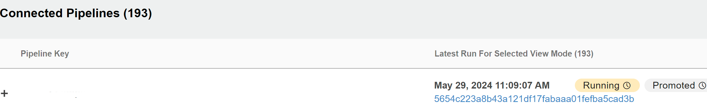

In Piper we have introduced a feature that allows generating and sending events to cumulus. The events data follows a standard, see [cloud events](https://cloudevents.io/) for more details.

<!-- more -->

## ❓ Why is this functionality needed ?

Although integration with cumulus was already a part of piper using the step [sapCumulusUpload](../../../../steps/sapCumulusUpload.md), users who used Sirius did not get a real time information about the compliance since the pipeline could still be running and the compliance information was not the complete picture in real time.

Compliance proof(s) will continue to be uploaded via files using the step [sapCumulusUpload](../../../../steps/sapCumulusUpload.md). However with the additional eventing real time metadata pipeline status can now be seen in cumulus like:

## 📢 Do I need to do something?

### - <b><i>If you are already using: </b></i>

- Vault as a secret engine in your pipeline which is provisioned from Hyperspace
- [Piper GPP pipeline](../../../../stages/gpp/overview.md)

    OR

- Piper provided [Init](../../../../stages/gpp/init.md), [Build](../../../../stages/gpp/build.md) and [Post](../../../../stages/gpp/build.md)

then the pipeline start and pipeline finished related events are already sent to cumulus and nothing more to do from your side.

### - <b><i>If you are not using the Piper GPP template or the above mentioned Piper provided stages and have a custom pipeline that is build by combining piper steps then:</b></i>

- Vault as a secret engine in your pipeline which is provisioned from Hyperspace

- you would need to add the piper step ``gcpPublishEvent`` in your pipeline keeping the below order of steps to ensure the correct events are updated. Please note you would need to add the below step and parameters based on the orchestrator (Jenkins/Azure/Github Actions)

- Pipeline start event after piper step ``sapPipelineInit`` completes successfully:

        Piper step name:
            gcpPublishEvent
        Step parameters:
            eventType = "sap.hyperspace.pipelineRunStarted"
            topic = "hyperspace-pipelinerun-started"

- task run event after piper step ``artifactPrepareVersion`` completes successfully:

        Piper step name:
            gcpPublishEvent
        Step parameters:
            eventType = "sap.hyperspace.pipelineTaskRunFinished"
            topic = "hyperspace-pipelinetaskrun-finished"
            additionalEventData = "{\"taskName\": \"artifactPrepareVersion\",\"outcome\":       \"success\"}"

- Pipeline finished event after step ``sapReportPipelineStatus`` completes successfully:

        Piper step name:
            gcpPublishEvent
        Step parameters:
            eventType = "sap.hyperspace.pipelineRunFinished"
            topic = "hyperspace-pipelinerun-finished"

### - <b><i>If you are not using the vault namespace provisioned from Hyperspace</b></i>

- This will need a change in your Vault namespace that may require Vault team support .
Please refer to [needed changes](https://github.tools.sap/project-piper/piper-documents/blob/main/poc/automated-technical-user/vaullt-identity-engine-oidc.md#integrate-vault-as-a-oidc-provider-for-gcp) in your Vault namespace

## 💡 What do I need to know?

- the step publishes the event and Cumulus listens to this event and reacts. The publishing of events is done without the need for a technical user to reduce the cognitive load on development teams to maintain a new technical user. There is a trust based authentication between Vault and GCP. Due to this trust the Vault provisioning must happen via Hyperspace or you will need changes in your vault namespace as stated above to start using the new feature in cumulus.

- the step ``gcpPublishEvent`` is designed in such a way that a failure of the step will not fail the pipeline so as to no block pipelines.

## 📖 Learn more

- [Technical tam documentation](https://github.tools.sap/project-piper/piper-documents/blob/main/poc/automated-technical-user/vaullt-identity-engine-oidc.md) on how the new authentication works

- [Piper adr about event integration](https://github.tools.sap/project-piper/piper-documents/blob/main/adr/20240521-pipeline-events.md)
