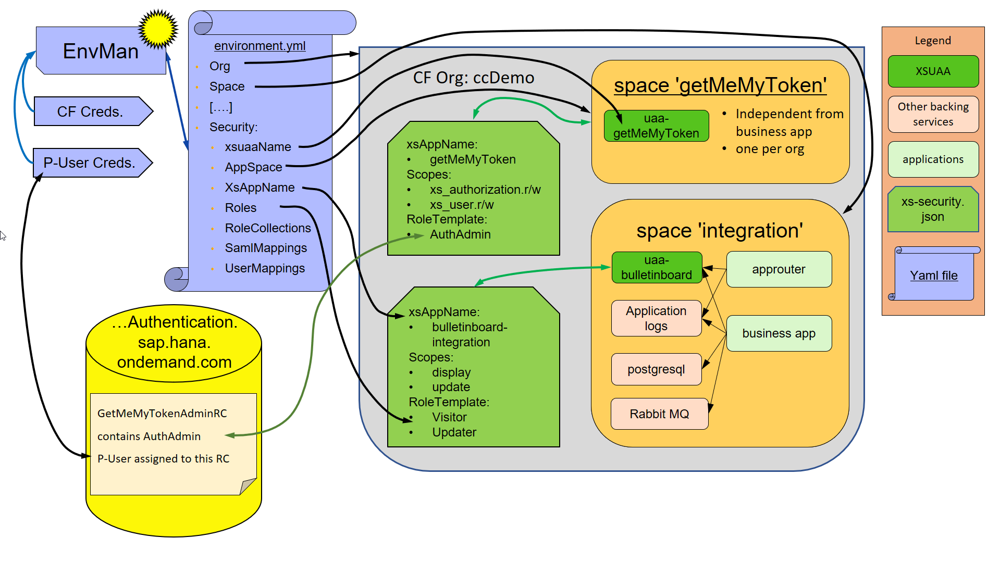

# Setup Security with EnvMan

!!! note
    This part of EnvMan is beta, use with caution. Please report any issues. Available since EnvMan version 0.7.0. (Piper v1.13.1+)

!!! info
    If something here is unclear etc. please contact [Moritz Schoenwandt](mailto:moritz.schoenwandt@sap.com)

We automated the Setup of Authorization Model for Applications in SAP CP Cloud Foundry by implementing calls to [APIs for Role, User, Tenant, Subscription Management](https://wiki.wdf.sap.corp/wiki/display/xs2/APIs+for+Role%2C+User%2C+Tenant%2C+Subscription+Management).
On this page we describe how you can use the EnvironmentManager to automatically set up Roles, set up RoleCollections and set up User and SAML Mappings to RoleCollections. This is relevant for automated system Tests and manual acceptance tests.

## What can the `setup-security` command of EnvironmentManager do

- create _Roles_ from _RoleTemplates_
- create _RoleCollections(RC)_
- add _Roles_ to _RoleCollections_
- assign _RoleCollections_ to _Users_
- assign _RoleCollections_ to SAML _user groups_ of custom TrustConfigurations
- with `delete-security` you can remove/undo/delete all the above.

## Requirements

Next to the normal requirements the `setup/delete-security` command of EnvMan needs a few more things setup to run. Same goes if setup-environment is used with a YAML file containing a security section. The first 3 requirements are only needed to be setup once for a CF-subaccount:

- a custom TrustConfiguration for the SAML-Mapping of a FakeIdP
- a xsuaa backing service (in a dedicated separate space) where the scopes _xs_authorization.read/write_ and _xs_user.read/write_ are mapped to a RoleTemplate
- a user who is assigned to a RoleCollection which includes a Role of said RoleTemplate (probably different from the CF Credentials)
- credentials for this user
- needs cURL installed to work (nothing to do if used with manageCloudFoundryEnvironment piperstep and piper-cf-cli docker (default))

### custom TrustConfiguration

Create a custom TrustConfiguration. EnvMan assumes a default name `xsuaa-monitoring-idp`. If your name is different you have to set it in your security.yml in the security section under`samlIdpName:<nameOfyourIdp>`.

### xsuaa instance

You can use the EnvMan to setup the space and xsuaa instance. For this is [here the environment.yml](getMeMyToken/environment_yml.md) and [here the xs-security.json](getMeMyToken/xs-security_json.md). Or you can to so by hand in CloudCockpit. The name of the xsuaa instance will be needed in the YAML file in the security section under `xsuaaName`. After the first run of `setup-security` there will be a service-key generated for this xsuaa instance. (see Technical Details for more information if interested)

### Assignment to RoleCollection

Since you need the user assigned to the RoleCollection to use `setup-security` you currently need to manually do this once when you created your subaccount.

### Credentials

The Credentials of said user gets read in from the environment variables `MH_USERNAME` and `MH_PASSWORD`.
During a pipeline this can be set with the `mhCredentialsId` parameter. E.g.:

```groovy
    manageCloudFoundryEnvironment(script: this, command: "setup-security -y security.yml", mhCredentialsId: "Id of Credentials in Jenkins")
```

This parameter can also be set in the config.yml.

### cURL

The EnvMan interacts with an API directly. To do so it currently uses `curl`. The piperstep manageCloudFoundryEnvironment uses per default the piper-cf-cli docker where this is already provided. So most likely nothing to do here.

## order of setup and delete

| entity | setup | delete |
| --- | :---: | :---: |
| roles | 1st | 4th |
| roleCollections | 2nd | 3rd |
| roles to RC | 3rd | - |
| RC to user group | 4th | 2nd |
| RC to user | 5th | 1st |

## The security.yml

Or to be more precise, the security section in an environment.yml. A detailed description of all entries can be found in the [Environment YAML section](yml.md).
A principle here is that the entries in the YAML file also reflect the relationships of the entities. If you want to specify a role in the roleCollections part you also have to define it at the roles part before. The same goes for roleCollections used in samlMappings or userMappings. Those also have to appear at the roleCollections part with at least the name (but no roles needed).
The security section can be the only section of an environment.yml or be part of an overall environment.yml where also backing services etc. are defined. Since during `setup-environment` backing services are created before security is setup you can also define the xsuaa instance in the same yml as the authorization model itself.
The application for which the authorization model is defined is identified by the `xsAppName` of the to the application bound xsuaaInstance (specified in the xs-security.json)

The following picture shows the connection between the different elements used during setup-security.


### examples

[ExampleFile with Security](example-security-yml.md)

## Technical Details

As a first step of `setup-security` EnvironmentManager tries to retrieve a service key `xsuaa-getMeMyToken-servicekey` in the `appSpace` of the security section. If such a service key does not exist it generates it automatically (it does `cf create-service-key <xsuaaName> xsuaa-getMeMyToken-servicekey`) and retrieves it then. From this service key it reads the _clientSecret&Id_ and the identity zone (subdomain). For this the CF_Credentials are used.
It now uses the  _clientSecret&Id_ and the user credentials to get an access token for the API which contains the scopes  _xs_authorization.read/write_ for RoleCollection and Role creation  and _xs_user.read/write_ to assign RoleCollection to a user. To get said token the EnvironmentManager send a json containing _clientSecret&Id_ and the user credentials to `https://${subdomain}.authentication.sap.hana.ondemand.com/oauth/token`. After obtaining the token it now works through the provided YAML file and calls the different API endpoints. First looping over creating all roles specified, then lopping over creating a RoleCollection and adding roles to it. After this it loops over the SAML-Mapping before finally making all the assignments of RCs to users.

## Alternative ways for EnvMan to get _clientSecret&Id_

If you do _not_ want to use service keys you can also alternatively bind an app to the xsuaa instance. If you specify `appName` and not specify `xsuaaName` the EnvMan will retrieve the vcap_service environment variable from the application by the given name to obtain the _clientSecret&Id_.
The application could be your business application which you want to test or for which you want to setup the Authorization Model or some other application running in the same identity zone/CF org. However, the xsuaa instance of that app has to have a RoleTemplate with the same 4 scopes  _xs_authorization.read/write_ as before. And the P-User has to be assigned to a RoleCollection in that org which holds the same scopes (but not necessarily coming from the same role). In this case we recommend a standalone app running in a dedicated space (see GetMeMyToken).
