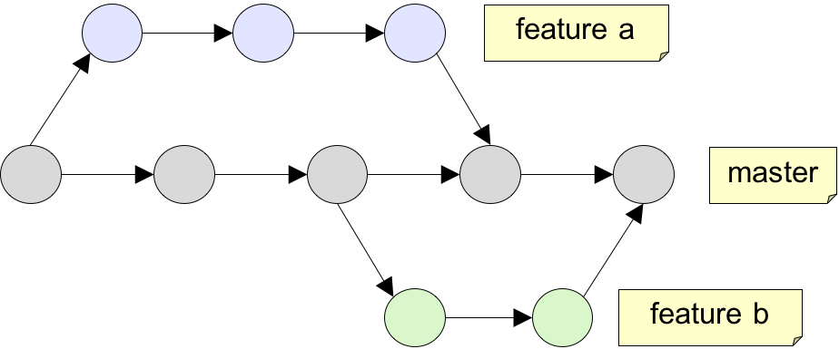
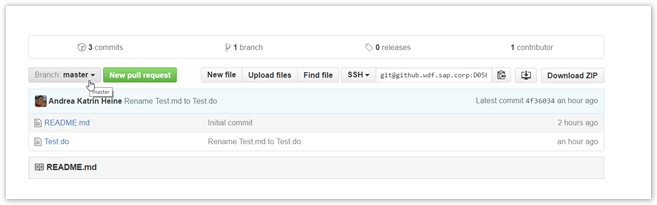
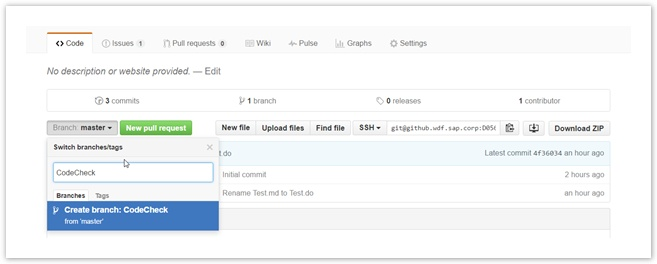

# Feature toggles & branches

In "public-cloud-only" applications ideally you do continuous delivery and do not need maintenance branches. You break down features so that they can safely be delivered incrementally. If circumstances do not allow this, you use feature toggles to hide unfinished work while still integrating as early as possible and as much as possible.

## Maintenance - Maintenance Branches vs. "One Mainline"

### One Mainline

In public cloud, the ideal situation is that an application follows the principle of "continuous delivery" and does not require so-called "maintenance" branches. There is only one codeline, which typically is called "main", "master", or "trunk". All code changes, new features as well as bug fixes, are done to the main line. This of course only works if changes from the main line can be deployed into production within a matter of minutes or hours, at least within a day - this is why continuous delivery is a prerequisite to this.

If it takes longer to deploy all changes from the main line into production (there can be multiple reasons for this, which will be discussed below), you will need a separate channel for delivering the bug fixes - a maintenance branch.

### Maintenance Branches

Maintenance branches are something you need if

* there is not only one single "live" application, but multiple, and you cannot control which version they're running, such as

  * on-premise scenarios, where different customers have different versions of the application running in production
  * "hosted on-premise" scenarios, i.e. it is a cloud solution, but every customer has an own instance and can decide on version/upgrade individually

* your delivery cycle is too long, so you cannot just fix the bug in the mainline, because e.g.

  * the degree of automation for a complete delivery is not high enough, so deploying to production every day will cost a significant amount of resources, hence money
  * the code of the main line is often in a non-working state; things are under construction and would break the system if deployed to production

A maintenance branch is basically a channel that allows you to ship bug fixes separately, and often separate rules & policies apply to this channel, especially if the reason for the long delivery cycles was "low degree of automation" (see above): in this case often not all checks are done in this separate channel.

A maintenance branch is forked from the "main" line when a new version is release/published, and is kept for as long as this version should be supported.

In an on-premise or "hosted on-premise" solution, the branches/versions are kept and maintained as long as it is agreed with the corresponding customers (contract!). So here you typically have multiple maintenance branches, as you have multiple "live" versions of the application running at the customer site.

In a public cloud application with long release cycles/no continuous delivery, the maintenance branch has to be kept as long as the current release is "live". When it is replaced with the next update, the maintenance branch can be removed / replaced by a new maintenance branch, which was again forked from "main" when the new version was released. So here you typically have only one maintenance branch, as you only have one "live" version.

**The downside of maintenance branches** is that bug fixes have to be double-maintained, i.e. integrated into all branches where the bug persists - potentially including "main", which is sometimes non-trivial.

## Unfinished Work - Feature Branches vs. Feature Toggles

Typically, even in an application that delivers very frequently (continuous delivery), an issue that arises is that not all features can be finished within a day. Obviously we don't want the developers to hold back their code changes on their local developer machine until the whole thing is finished, so there must be better ways of dealing with this unfinished work.

There are 3 options to solve or mitigate the issue

### 1. Deliver Small, Safe and Meaningful Increments

The best way to solve the issue is to break your feature / user story down into small, yet meaningful stories. Think about a leave request tool. It is a non-trivial feature and there are a lot of things to consider: working days are different in some countries, public holidays are different. There are different types of vacation like "time off in lieu" or "maternity leave" - again depending on different countries' laws and regulations. There are different public holidays - they may differ even within a single countries' regions. There can be vacation for just 1/2 days and more funny things.

Definitely a thing that cannot be developed within a few weeks or even a few days - yet you can break it down and always really "deliver" it:

* start with the simplest case, just a simple date picker or even just an input field, rudimentary validation, only full day
* the add more complexity with each further iteration

The advantage is that you can get feedback from early adopters much sooner - if you want. This is often valuable and helps you go in the right direction.

If you think it'd be too embarrassing to show it in this early state, you may still ship it and just hide the UI. So it already works, it has just limited functionality and you don't show it yet. And you already have integrated it in the main line and there are no "late surprises", the ultimate goal of continuous integration and continuous delivery - except for the surprise that may still come when the feature is actually used by the end-user for the first time.

### 2. Feature Toggles

From Martin Fowler[^2]:

"Picture the scene. You're on one of several teams working on a sophisticated town planning simulation game. Your team is responsible for the core simulation engine. You have been tasked with increasing the efficiency of the Spline Reticulation algorithm. You know this will require a fairly large overhaul of the implementation which will take several weeks. Meanwhile other members of your team will need to continue some ongoing work on related areas of the codebase. You want to avoid branching for this work if at all possible, based on previous painful experiences of merging long-lived branches in the past."

Feature Branches are discussed below - which will make clear where the pain described by Fowler comes from, in case you have not already experienced it yourself. The idea of a feature toggle is that you hide unfinished work behind a toggle at runtime.

How a toggle is created and should be evolved is described nicely in Fowlers article[^2], including code snippets. You may also check the Cloud Curriculum's presentation on feature toggles[^8]. Feature toggles are often preferred in public cloud applications with continuous delivery as they allow for an earlier and tighter integration than feature branches.

!!! note "Best Practice"

    * feature toggles should be the last thing you wanna have (well, probably the second last one - the last being feature branches - see next section), rather deliver small increments (see previous section)
    * you should avoid at all cost inter-toggle dependencies and
    * test with all toggles off (what is currently in production) and all toggles on (what if we activated in production)
    * the toggles have to disappear soon and entirely after the feature has been activated - you do not want to keep these "if" statements in your code

### 3. Feature Branches

An approach that used to be very popular - and is getting much less popular recently due to the rise of public cloud and continuous delivery, is called "feature branches"[^7]. The basic idea is that when you start working on a feature that takes longer time, you create a new branch (based on "main") to work on that feature. You push the unfinished work for that feature to this branch instead of "main" line. It is pretty similar to just holding back the changes locally until your work is finished, except for that you can share the work with your teammates who work on the same feature.

The feature branch will only be merged when all development is finished.

On Github, often "Pull Requests" are used to organize, review and merge the branches. So whenever you want to implement a new feature you start by creating a new branch in the project's GitHub repository. Take care that the new branch is always created from master branch:

You then work on your new feature exclusively in your new branch. You can commit your changes against this branch without disturbing the code on master branch. With the commits your colleagues and code reviewers have a great overview of the progress in your coding. For complex parts of code it is recommended to add commit messages to each commit to make the history even more understandable.

**The downsides of feature branches are:**

* this is not continuous integration: as stated above, it is rather like a local branch, so it is not clear what would happen if you would merge it into the mainline:

  * there might be merge conflicts - can be mitigated by (re-)pulling from master frequently
  * you don't do all the quality checks / the full pipeline, like for "master" - to mitigate you can do the build and further quality measures on these feature branches, on Jenkins you can use a plugin[^9] that facilitates this

* translation process: when you change a UI text in one of the branches, there are only 2 options, and neither of it is satisfactory:

  * the text change is transported to the translation system immediately from the feature branch, and the translated texts should also go back into the feature branch - but usually the tools do not really support this, and what if the same text is changed in 2 different branches?
  * the text change is only transported when the feature branch gets merged into "main" - but this means that when merging into "main", the feature is not yet finished, as the translation is not yet there - so there is no point in having a feature branch if it doesn't solve the problem we actually wanted to address: merge only when it's finished

!!! note "Best Practice"

    * feature branches should be the last thing you wanna have, rather deliver small, meaningful and safe increments (see above)
    * when the feature is finished, it should be merged into the master branch, so the feature branch should be created based on master (obvious)
    * you should pull from master frequently, at least daily, to avoid merge conflicts being detected late
    * assure quality on your branches by running a CI build and whatever quality measures which are cost- and time-wise feasible
    * give your branches descriptive names so that your colleagues / code reviewers know what you have been working on
    * in collaborative projects you do your colleagues a favor by adding a descriptive commit message to each commit

### Excursion: Canary Release

"Canary Release"[^3] is a concept used for risk reduction. Especially in public cloud applications with lots of users and/or with critical business processes running on it, it is crucial that if things are going wrong, not all users are affected. Even when the application development team does their very best, write the best code they can, have very high test automation, make use of static analysis tools, also have high degree of automation in their infrastructure, and test in an environment close to production: there's still Murphy's law - what can go wrong will go wrong. Canary release makes sure that if things go wrong, at least not everybody suffers, but only the canaries.
This also has to be considered, and especially for bigger changes that were hidden behind a feature branch or feature toggle. When you activate the feature in production, consider activating it for a subset of users first. For feature toggles this is described on Fowler's article on feature toggles[^2]. For feature branches the regular deployment mechanism is used for activation, so a canary deployment mechanism is the measure of choice.

[^2]: Martin Fowler - Article on feature toggles: [http://martinfowler.com/articles/feature-toggles.html](http://martinfowler.com/articles/feature-toggles.html)
[^3]: Martin Fowler - Bliki on canary release: [http://martinfowler.com/bliki/CanaryRelease.html](http://martinfowler.com/bliki/CanaryRelease.html)
[^7]: Martin Fowler - Bliki on feature branches: [http://martinfowler.com/bliki/FeatureBranch.html](http://martinfowler.com/bliki/FeatureBranch.html)
[^8]: Cloud Curriculum presentation on feature toggles: [https://github.wdf.sap.corp/cc-devops-course/coursematerial/raw/master/DevOps/Feature_Toggles/Feature_Toggles.pptx](https://github.wdf.sap.corp/cc-devops-course/coursematerial/raw/master/DevOps/Feature_Toggles/Feature_Toggles.pptx)
[^9]: Jenkins Github pull request builder plugin: [https://wiki.jenkins-ci.org/display/JENKINS/GitHub+pull+request+builder+plugin](https://wiki.jenkins-ci.org/display/JENKINS/GitHub+pull+request+builder+plugin)
