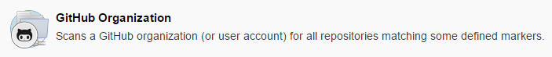
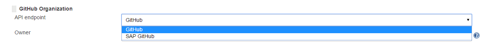
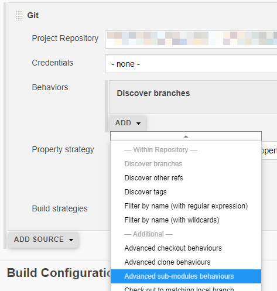

# Create your Jenkins jobs

!!! hint "Hyperspace Onboarding"
    The easiest way for starting is using the [Hyperspace Onboarding](https://hyperspace.tools.sap/)

    

Alternatively, once you have a running Jenkins you need to do some initial configurations to enable your Jenkins to be ready for the pipeline templates. 

For your individual jobs use the [Piper template](../../stages/README.md) and copy the snipped into a `Jenkinsfile` in your source code repository.

Once you have a `Jenkinsfile` in your repository you can configure the Jenkins job(s) accordingly:

* Create Jenkins Multibranch Pipeline or Jenkins Organization Folder project
* Prepare Central Build on xMake
* Additional pipeline configuration

## Jenkins Multibranch Pipeline or Jenkins Organization Folder

The best way to set up Jenkins Pipelines is via a Jenkins Multibranch Pipeline or a Jenkins Organization Folder project. 
This makes sure that Jenkins jobs are automatically set up for every repository/branch where a Jenkinsfile is found. 
The functionality is provided by the [GitHub Branch Source Plugin](https://wiki.jenkins.io/display/JENKINS/GitHub+Branch+Source+Plugin).

You find more details at [https://jenkins.io/doc/book/pipeline/multibranch](https://jenkins.io/doc/book/pipeline/multibranch)

!!! tip
    **Make sure that you use a user with organization admin permissions (for organization folders) or at least a user with repository admin permissions (for multibranch). **
    When using a user without admin permissions you need to set up GitHub web hooks manually, which inform Jenkins about any changes.

Example for an organization folder project:

In **Jenkins - New Item** set up the GitHub organization project to point to the GitHub organization which holds your source code repositories:

!!! warning "Use SAP's GitHub system!"
    Please make sure to use SAP's Enterprise GitHub system instead of the public GitHub system.
    By default the plugin will reach out to the public GitHub repository and your organization and repository will likely not be found there.
    

    The SAP Enterprise GitHub needs to be configured in your Jenkins system configuration:
    

### Using git submodules

In case you use git submodules in your project, you may need to set some advanced git settings for your Jenkins job:

### Prepare Central Build on xMake

The Piper pipeline delegates the build step to xMake to achieve compliance with SAP's corporate standard [SLC-29](https://wiki.wdf.sap.corp/wiki/display/pssl/SLC-29).

Xmake jobs are triggered via Parameterized Remote Trigger plugin.
Please follow the description for step [executeBuild](../../steps/executeBuild.md) to set this up.
