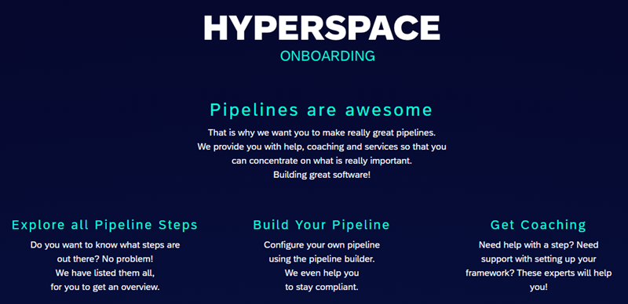
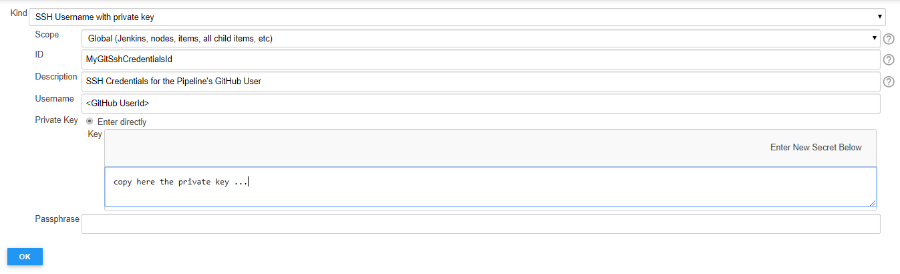

# Perform initial Jenkins configuration

Once you have a running Jenkins you need to do some initial configurations to enable your Jenkins to be ready for the pipeline templates.<br />

!!! hint "Hyperspace Onboarding"
    The easiest way for starting is using the [Hyperspace Onboarding](https://hyperspace.tools.sap/)

    [](https://hyperspace.tools.sap/)

**It is also possible to manually go though following simple steps to get your Jenkins prepared as well:**

## Git configuration

### known_hosts

`github.wdf.sap.corp` needs to be in the `known_hosts` configuration for your git client.

The easiest way to add it is via a custom Jenkins pipeline script:

Create a new manual pipeline job (_Jenkins_ -> _New Item_ -> select -> _Pipeline_ -> Provide **your job name** -> _OK_)<br />
Now enter following script in the section _Pipeline_ - _script_:

```groovy
node {
    sh 'mkdir -p $JENKINS_HOME/uploadedContent/.ssh'
    sh 'ssh-keyscan -H github.wdf.sap.corp >$JENKINS_HOME/uploadedContent/.ssh/known_hosts'
}
```

!!! note
    If not running on JaaS, you need to adapt the location of the _.ssh_ directory, typically to the home directory of the user running Jenkins (default for [piper-docker-jenkins image](https://github.wdf.sap.corp/ContinuousDelivery/piper-docker-jenkins) is `$JENKINS_HOME`.

### Git SSH credentials

Git SSH credentials need to be maintained for a user that has write permissions on your repositories.
You may consider to create a [dedicated service account](https://service-accounts.wdf.sap.corp/) which you then can register as GitHub user with the required permissions.

You can use following Jenkins pipeline script (create another job as for known-hosts above) for creating the private and public key (**Please change the value of the email address**):

```groovy
node {
    deleteDir()
    def email = '<email of your GitHub User>'
    sh "ssh-keygen -t rsa -b 4096 -C ${email} -f ./id_rsa -N '' > /dev/null"
    echo """
-----------------------------------------------------------
PRIVATE KEY TO BE MAINTAINED IN JENKINS AS SSH CREDENTIALS:
Note: copy incl. '-----BEGIN ...' AND '-----END' lines
-----------------------------------------------------------
${readFile('id_rsa')}
-----------------------------------------------------------
PUBLIC KEY TO BE UPLOADED TO THE GITHUB USER PROFILE VIA
https://github.wdf.sap.corp/settings/ssh/new:
-----------------------------------------------------------
${readFile('id_rsa.pub')}
-----------------------------------------------------------"""
    deleteDir()
}
```

**Store the value of the private key as Jenkins credential:**<br />
_Jenkins_ -> _Credentials_ -> _System_ -> _Global credentials (unrestricted)_ -> _Add Credentials_:


!!! note
    Remember the id of the credential entry. The credentialId you define here needs to be used in the Piper configuration for `gitSshKeyCredentialsId`.

**Upload the public key to GitHub**:<br />
[GitHub - add new ssh key](https://github.wdf.sap.corp/settings/ssh/new)

**Further information:**

* [Using Jenkins credentials](https://jenkins.io/doc/book/using/using-credentials/)

## Define Global Pipeline Libraries

!!! tip "Typically pre-configured"
    If you use  [Jenkins as a Service](https://jenx.int.sap.eu2.hana.ondemand.com/api/) or the (deprecated) [piper-docker-jenkins image](https://github.wdf.sap.corp/ContinuousDelivery/piper-docker-jenkins) the library setup is available by default. Both include a startup script to take care of a proper configuration.

In **Jenkins - Manage Jenkins - Configure System** define two global pipeline libraries as described [here](../../lib/setupLibrary.md):

1. `piper-lib` - pointing to SAP internal Piper step library (<https://github.wdf.sap.corp/ContinuousDelivery/piper-library.git>)
2. `piper-lib-os` - pointing to Open Source Piper step library (<https://github.com/SAP/jenkins-library.git>)

## Configure E-Mail notification

For **Jenkins as a Service** e-mail notification should already be pre-configured. Make sure that the **Extended E-mail Notification** is set:

```text
SMTP Server: mail.sap.corp
Default user E-mail suffix: @exchange.sap.corp
```

For the other Jenkins options, please configure E-mail notification as described for example [here](https://wiki.wdf.sap.corp/wiki/display/SAPPIN/Jenkins+Configuration+for+CF+Pipeline#JenkinsConfigurationforCFPipeline-ActivateE-MailAlertinginJenkins)

## Configure Influx DB target

**This is optional and can be configured at a later point in time**.

The templates include a mechanism to monitor the pipeline itself via e.g. a Grafana Dashboard connected to an InfluxDB.<br />
The pipeline will write pipeline metrics into an InfluxDB connected to your Jenkins.

You find details about the configuration in the documentation of the [influxWriteData](../../steps/influxWriteData.md) step.
