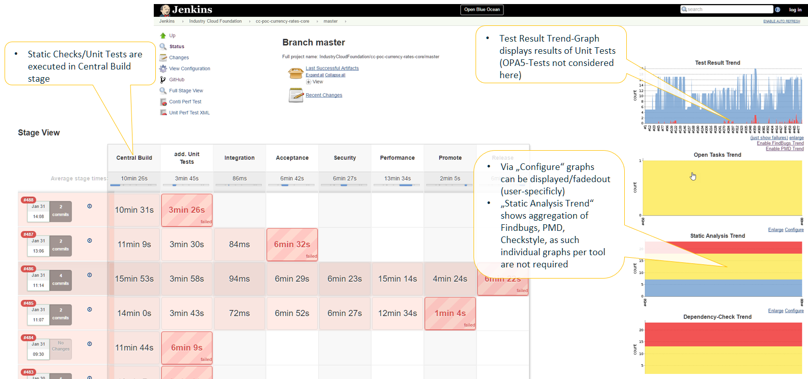
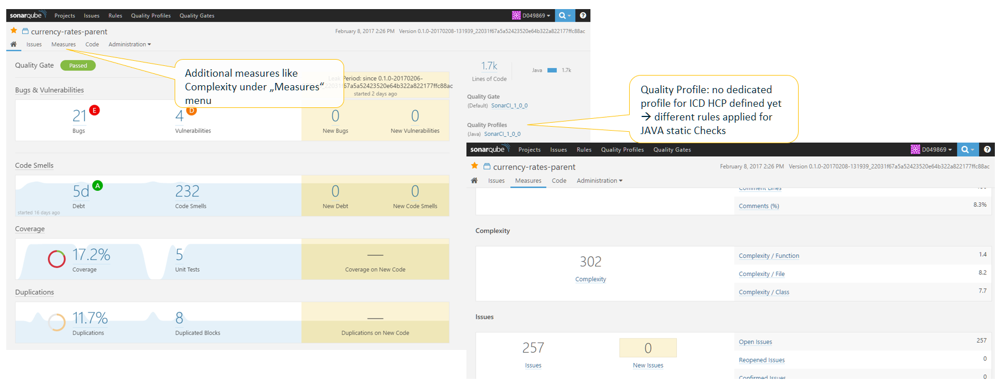

<!-- markdownlint-disable-next-line MD041 -->
## static checks & other Quality KPIs included in xMake STAGE

### Description

There is a number of Quality KPIs which you can trigger to be executed and reported during the xMake STAGE build (Build Stage):

- [**static Checks / SonarQube**](#sonarqube) (Set of Quality KPIs including static checks, test coverage, complexity...)
- [**JAVA Unit Tests & Test Coverage**](#unit-tests-for-java) (execution of tests + TestCoverage (JaCoCo))

not executed as part of xMake STAGE, but as separate build in a dedicated stage (see [Add. Unit Tests-Stage](https://github.wdf.sap.corp/ContinuousDelivery/jenkins-pipelines/blob/master/documentation/steps/README.md#add-unit-tests)):

- **Unit tests for Fiori-UIs** (for details see [execution of OPA5-Tests](../steps/karmaExecuteTests.md))

### General Prerequisites

- the configuration of static checks execution is setup in your development project's configuration; JAVA module(s) inherit(s) from [HCP JAVA Parent-POM](https://github.wdf.sap.corp/IndustryCloudFoundation/HCP-Java-Parent)
- Unit Tests are implemented and available at the expected location (`src/test/java`)
- pipeline script contains the corresponding steps and related plugins are installed

#### Quality KPIs in Jenkins Pipeline (Overview)



#### Quality KPIs in SonarQube



## Static Checks for JAVA

### Prerequisites

- the configuration of static checks execution is setup in your development project's configuration; JAVA module(s) inherit(s) from [HCP JAVA Parent-POM](https://github.wdf.sap.corp/IndustryCloudFoundation/HCP-Java-Parent)
- pipeline script contains the corresponding steps (archive/publish in jenkinsfile)

### configuration requirements

none (no corresponding attributes or settings in pipeline config file for this pipeline step)

### Explanation of pipeline step

see [checksPublishResults](../steps/checksPublishResults.md) for details

**Details:**

- execution of JAVA static checks (Findbugs, PMD, Checkstyle) is triggered by [HCP JAVA Parent-POM](https://github.wdf.sap.corp/IndustryCloudFoundation/HCP-Java-Parent) using dedicated [filtersets](https://github.wdf.sap.corp/IndustryCloudFoundation/HCP-Java-Parent/tree/master/checks/filters)
- the results for the static checks are available in the job details page in your jenkins and on the pipeline page corresponding graphs should be displayed

**Note:** If you want the build to fail in case of a certain amount of static check issues you can define corresponding thresholds (`healthy:` / `unHealthy:`) in the pipeline script (you can use the snippet generator of your jenkins server)

## Unit Tests for JAVA

<!-- markdownlint-disable-next-line MD024 -->
### Prerequisites

- JAVA module(s) inherit(s) from [HCP JAVA Parent-POM](https://github.wdf.sap.corp/IndustryCloudFoundation/HCP-Java-Parent)
- Unit Tests are implemented and available at the expected location (`src/test/java`)
- surefire plugin is used for test execution
- pipeline script contains the corresponding steps (publish in jenkinsfile)

### configuration requirement

none (no corresponding attributes or settings in pipeline config file for this pipeline step)

<!-- markdownlint-disable-next-line MD024 -->
### Explanation of pipeline step

see [testsPublishResults](../steps/testsPublishResults.md) for details

**Details:**

- execution of JAVA unit tests (if no unit tests are available there is a corresponding hint in the log, but build continues)
- report calculated coverage as configured in [HCP JAVA Parent-POM](https://github.wdf.sap.corp/IndustryCloudFoundation/HCP-Java-Parent)
- you find the corresponding JaCoCo graphs and details in the job details page in your jenkins and on the pipeline page a corresponding graph for test coverage should be displayed

## Static Checks for JavaScript / Fiori

<!-- markdownlint-disable-next-line MD036 -->
*documentation coming soon*

### NPM projects

For NPM based projects/modules, there is a highly configurable static check tool available, [ESLint](http://eslint.org).

Install `eslint` and the taskrunner [`grunt`](https://gruntjs.com/getting-started):

```shell
npm install --save-dev grunt gruntify-eslint
```

Create a `.eslintrc.yml` file next to the `package.json` with the following config:

```yml
extends: eslint:recommended
globals:
  sap: true
  jquery: true
env:
  browser: true
  node: true
  es6: true
```

Create a `Gruntfile.js` with the following tasks:

```js
module.exports = function(grunt) {
  grunt.initConfig({
    pkg: grunt.file.readJSON('package.json'),
    // task for linting Javascript sources
    eslint: {
      options: {
        format: 'jslint-xml',
        outputFile: 'target/eslint.jslint.xml',
        silent: true
      },
      src: ['.']
    },
  });
  grunt.loadNpmTasks("gruntify-eslint");
  // Default task(s).
  grunt.registerTask('default', ['lint']);
  // Lint task(s).
  grunt.registerTask('lint', ['eslint']);
};
```

To execute `eslint` in the NPM build, add the script `"lint": "node_modules/grunt/bin/grunt lint"` to your `package.json` file.

### MTA projects (MTA Build Tool)

## SonarQube

[SonarQube®](https://www.sonarqube.org/) software (previously called Sonar) is an open source platform, dedicated to continuously analyze and measure the technical quality of your code. For details on how to work with Sonar at SAP see the following wiki: [Code Analysis with SonarQube 6.x](https://wiki.wdf.sap.corp/wiki/x/VNtXbw).

SonarQube results are not available in your Jenkins, but in [SonarQube server (sonarci)](https://sonarci.wdf.sap.corp:8443/sonar).

See the step description for [executeSonarScan](../steps/executeSonarScan.md) and [this blog post](https://jam4.sapjam.com/blogs/show/cgNLRV9S9fNuU4tSG6mK0a?_lightbox=true) for implementation details.
