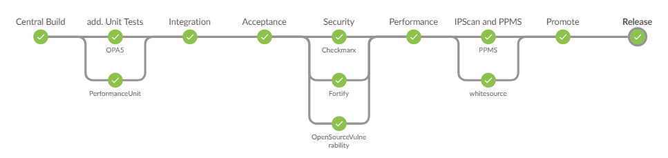

# Piper general purpose pipeline

The Piper ready-made pipeline consist of a sequence of stages where each contains a number of individual steps.

The general purpose pipeline comprises following stages:

* [Init Stage](gpp/init.md)
* [Pull-Request Voting Stage](gpp/pr_voting.md)
* [Build Stage](gpp/build.md)
* [Additional Unit Test Stage](gpp/additional_unit_tests.md)
* [Integration Stage](gpp/integration.md)
* [Acceptance Stage](gpp/acceptance.md)
* [Security Stage](gpp/security.md)
* [Performance Stage](gpp/performance.md)
* [IP Scan and PPMS Stage](gpp/ipscan_ppms.md)
* [Confirm Stage](gpp/confirm.md)
* [Promote Stage](gpp/promote.md)
* [Release Stage](gpp/release.md)
* [Post Stage](gpp/post.md)

<!-- TODO: Introduction into the stage conditions -->

!!! note "Configuration to enable the pipeline stages and all included steps"

    The Piper ready-made pipeline provides a number of stages with a lot of contained steps which are orchestrated by the pipeline. 
    Each step may require certain setup activities.

    We recommend you to get started by getting the central build stage running first.
    Then you can iterate and step by step activate further pipeline steps until your pipeline is fully functional.
    All Piper steps provide you a description of pre-requisites, please see [Library Overview section](../lib/README.md) for details.

!!! note "buildTool"

    Please make sure that you specify the correct build tool.
    Support for a dedicated `buildTool` depends on support in the step [`artifactPrepareVersion`](../steps/artifactPrepareVersion.md).

    Following are supported for example:

    * `docker`
    * `dub`
    * `golang`
    * `gradle`
    * `maven`
    * `mta` (please see [additional notes below](#limited-mta-support))
    * `npm`
    * `pip`
    * `sbt`

    If your build tool is not supported by [`artifactPrepareVersion`](../steps/artifactPrepareVersion.md) you can still use further options as described for [Pull-Request Voting Stage](prvoting.md)

## Limited MTA support

MTA artifacts support many technologies to be bundled within one mtar file.
Judgment about which tools and configurations to use for e.g. security scanning depends on used programming languages and build technologies.

MTA artifacts are not recognized by standard scanning tools, and thus, all parts need to be scanned individually using proper tooling and configuration.
Essentially, a generic MTA behaves much like a monorepository.
**Please be aware that there is [no monorepo support](README.md)** with the "Piper general purpose pipeline".

**MTA support in the "Piper general purpose pipeline" is limited to MTAs containing Java (maven) and Javascript (npm) artifacts.**
Only for this case the setting `buildTool: mta` will properly execute Open Source vulnerability scanning using WhiteSource.
In order to properly execute a SAST (static application security testing) scan, you need to configure both Fortify as well as Checkmarx to run in your pipeline.

**For all other cases, a project-specific judgement needs to be made** and scan tools may need to be executed multiple times with different configurations.
This likely requires you to at least extend the pipeline using [extensibility possibilities](../extensibility.md). It might also be possibly that you require a custom pipeline definition.
