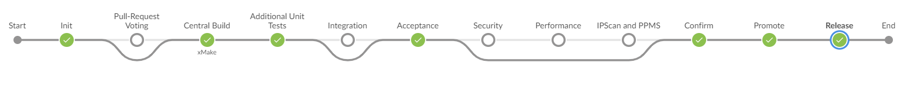
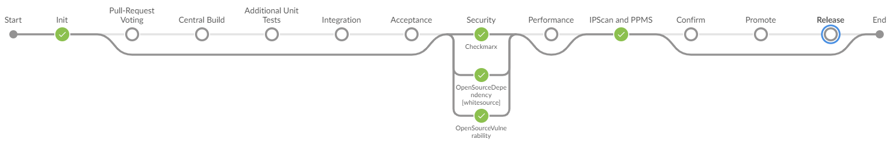

<!-- markdownlint-disable-next-line first-line-h1 -->
<a href="https://pages.github.tools.sap/hyperspace/academy/pavedroad/BTP_DwC"></a>

# Pipeline optimizations

The "general purpose" pipeline provides several means for optimizing runtimes and pipeline availability.

The overarching goal is to allow for 99.5% success rate of a "Continuous Deployment" pipeline which runs on every commit to "Trunk" (main branch).

Having individual pipeline service availability of 99.9%/99.95% leaves us with allowing 5-10 tools/landscapes to be used within a continuous deployment pipeline.

Following tools are considered as essential:

* GitHub (as version control system)
* Vault (as system for storing credentials)
* CD orchestrator (e.g. Jenkins)
* Artifact storage (e.g. Nexus) for consuming and publishing artifacts
* Container registry (e.g. Artifactory) for consuming and publishing containers
* xMake central build or Piper Native Build on JaaS
* Staging service for providing stage/promote functionality into release repositories (so far interfaced via xMake system)
* Cumulus (as audit compliant storage)
* Deployment tooling (e.g. Deploy with Confidence) and/or deployment landscape (e.g. Cloud Foundry, MTA deploy service, Kubernetes) unless an "indirect" deployment approach has been chosen like e.g. GitOps

## Taking care for a high availability of your pipeline

If you value a high SLA of your pipeline you need to care for following aspects:

### 1. Number of deployment landscapes

Each landscape you directly deploy to from your pipeline reduces the overall availability of your pipeline.

#### Using CF Canary & CF Prod (e.g. EU10)

By deploying to CF Canary for testing and CF Prod (e.g., EU10), you make yourself dependent on the availability of both landscapes.
If you care about high pipeline availability you may consider making test deployments to a dedicated "space" in your production landscape or even decouple the functional validation to your deployment process (e.g. ["Deploy with Confidence" (DwC)](https://pages.github.tools.sap/deploy-with-confidence/solar-system/) as mentioned below).

#### Multiple productive landscapes

You might be required to deploy to multiple productive landscapes from within your pipeline while keeping a high overall pipeline availability.

For such cases a **direct deployment to the various landscapes from within your pipeline is highly discouraged**.

There are multiple possibilities how to keep up a high pipeline availability while ensuring a proper deployment to your target landscapes.
In the end it is about decoupling the pipeline flow from the deployment:

* ["Deploy with Confidence" (DwC)](https://pages.github.tools.sap/deploy-with-confidence/solar-system/) is an SAP-internal solution which will assist you in more complex deployment flows. It is the primary choice, especially when working with larger products.
* GitOps: This is a prominent option, especially in the Kubernetes space to decouple deployments from a pipeline run. Piper provides the step [gitopsUpdateDeployment](../steps/gitopsUpdateDeployment.md) to allow such a pattern. GitOps tools (e.g. Argo CD) need to be operated in the respective project-specific Kubernetes landscape. So far no central service offering is available here.

The mentioned list is not complete and is solely meant as a starting point for project-/product-specific discussions.

### 2. Decoupling Deployments from Releases

It is important to differentiate "Deployments" from "Releases".

#### Deployment

A deployment makes a new technical version of e.g. a microservice available.
This can be a deployment of a fix, a hidden feature, ...
All aspects for a deployment can run fully automatic.

#### Release

A release (often also referred to as "feature release" or "functional release") provides new functionality to the end users.
Releases typically require some manual activities, e.g. a release decision.

### 3. Shift left

Your Continuous Deployment pipeline should be considered as a safety-net for things you were not able to identify earlier.

Mature development teams perform most of the checks already locally so that later surprises are kept to a minimum.

### 4. Shift down

It is important to not misuse a CD pipeline as the Swiss Army knife to automate everything.  
In addition shifting left also has its limits.

In order to address this, we aim to push more workloads down onto the Hyperspace platform as explained in more detail below.

There is an [excellent article on this topic written by Richard Seroter](https://cloud.google.com/blog/products/application-development/richard-seroter-on-shifting-down-vs-shifting-left?hl=en)

## Optimizations of the "general purpose" pipeline with respect to Open Source compliance and Security

!!! tip "The new default option"
    With the advent of supporting GitHub Actions (GHA) from within Hyperspace and providing the [Hyperspace Open-Source Compliance service (OSC)](https://pages.github.tools.sap/hyperspace/academy/services/osc/) we took the next step in simplifying the Piper general purpose pipelines (GPP), making them more robust, faster and focused.

Open-Source checks using OSC and execution of SAST scans will no longer run inside the GPP, making tool configurations as well as PPMS FOSS updates obsolete. This decoupled execution is also our recommendation for any automation going forward.  
It will reduce pipeline runtimes and the need for context switches. OSC will for example only alert change-related findings when executed on a pull request. In addition, pipelines will no longer be stopped for new findings for components already in production.  
Furthermore, stability of your build is increased and therefore brings you into a better position in case time is critical, for example in case an urgent hotfix is required.

Your Software Bill of Materials (SBOM) gets automatically updated from each Piper native build execution.
**Open-source** checks run completely outside the Build Pipeline orchestrator (**"shift down"**). They are triggered by SBOM updates to provide timely feedback on issues (identified based on SAP’s compliance guidelines).
You can find details in the [documentation of OSC](https://pages.github.tools.sap/hyperspace/academy/services/osc/).
Soon, it will also be possible to run OSC directly on your pull-request to receive feedback before even bringing a change to your main code line.

**SAST scans** will be executed via a dedicated GitHub Actions workflow – independent of your orchestrator of choice for your build pipeline.  
You will benefit from faster feedback: By default, SAST feedback is provided already on pull request level and due to the parallel execution on your main branch, you will also receive feedback earlier.  
In addition, since the dedicated workflow runs on every commit to your repository, SAST evidence will now be created for every change. This is unlike the behavior which is described below as [Using pipeline optimization via multiple run-modes](#multiple-run-modes-of-the-general-purpose-pipeline).

## Multiple run-modes of the "general purpose" pipeline

The "general purpose" pipeline comes with two "run-modes" in order to support teams in achieving high availability of the pipeline as well as with respect to the increasing demand for shorter pipeline runtimes.

!!! warning "No longer use this option for new pipelines which you set up"
    While it is still possible to use this option we encourage you to make use of the optimizations mentioned before, i.e. using OSC and dedicated GitHub Action SAST workflows.

    We are not exposing this option during CI/CD setup via the [Hyperspace Portal](https://portal.hyperspace.tools.sap/home).

    In case OSC is not supported yet for your use-case you have a [fallback option](https://pages.github.tools.sap/project-piper/setup_pipeline/#security-and-compliance-pipeline-only-github-actions).

??? "Using pipeline optimization via multiple run-modes"

    !!! note "Activating pipeline optimization via multiple run-modes"
        You can activate the behavior with just one flag in your configuration:

        ```yml
        general:
        pipelineOptimization: true
        ...
        ```

    !!! info "GitHub Actions only"

        As Hyperspace as a platform is evolving so are we. We heard the pain points associated with tools (configuration, maintenance, etc.) hence we are making a gradual shift from tools to services. With that we have dropped the optimized pipeline approach from GitHub Actions.

        To facilitate that we have carved out `Security` and `IPScan and PPMS` stages from the template. The Security stage has two parts to it - SAST + OSS. Kindly check the [documentation](https://github.wdf.sap.corp/pages/Security-Testing/doc/) from Security Testing for more details on SAST part.

        Instead of relying on two stages for Open Source Security & IPScan/PPMS Compliance, we have now replaced it with a [single workflow](https://github.tools.sap/project-piper/piper-pipeline-github/blob/main/.github/workflows/sap-oss-ppms-workflow.yml) which takes care of all of your OSC needs. We would recommend to run this workflow on scheduled basis, for example, once per day.

        If you are migrating from an existing Orchestrator to GitHub Actions then this might seem like a huge change. But GPP has transformed to run only the commit based pipeline which should help you bring your code from commit to Production in a shorter span without compromising on your compliance needs which are mandatory for your productive releases.

        Do not include the `pipelineOptimization` parameter in the pipeline configuration file.

    !!! info "Prerequisite"
        Please make sure to maintain GitHub token credentials. This is needed for providing feedback of the scheduled run as GitHub issues. Also, make sure that GitHub repository details are maintained on `general` level:

        ```yml
        general:
        ...
        owner: project-piper
        repository: azure-demo-k8s-go
        ...
        ```

        For further details about GitHub token credentials, please check [githubCreateIssue](../steps/githubCreateIssue.md)

    !!! warning "Jenkins only: pipeline must not run in resilient mode"
        Running the "general purpose" pipeline in the optimized mode while also running the pipeline in "resilient" mode (`failOnError: false`) is mutually exclusive.

        You either need to remove `failOnError` from the step configuration of `handlePipelineStepErrors` or set `failOnError: true`

    ### "commit" mode

    In the "commit" mode all essential services are executed in order to allow a deployment to a productive landscape.

    <!-- markdownlint-disable-next-line MD036 -->
    _further information will be added_

    !!! warning "Deployment is NOT a Release"
        "Deployment" has to be distinguished from a "Release" (as already indicated above) in order to achieve the SLA target of 99.5%:

        A "Deployment" is a pure technical update of the software version running in production without providing new functionality to the end-users whereas
        a "Release" provides new functionality to the end users.

        In case "Deployments" are coupled to a "Release", requirements of both have to be considered and the goal of 99.5% cannot be achieved.

    

    ### "scheduled" mode

    In the "scheduled" mode further aspects are checked which require regular attention of the development team.
    These aspects are not considered mandatory for a "deployment" BUT are considered MANDATORY for a "release".

    The scheduled mode is typically executed once per day in order to allow for timely notifications in case issues have been found.

    !!! tip "Orchestrator-specific scheduling configuration"

        === "Jenkins"

            Schedule is defined as `nightlySchedule` as per [ setupPipelineEnvironment ]( ../steps/setupPipelineEnvironment.md )

            Default setting is `H(0-59) H(18-23) * * *` which translates to a random start time (between 18:00 and 0:00), once per day.

            If you change value of `nightlySchedule` in your configuration after first time, additional build schedules are added in Jenkins. This makes Jenkins run in multiple schedules.
            To clear old schedules, please run pipeline (in commit or scheduled mode) once with `runNightly: false` and/or `pipelineOptimization:false` depending on what is present in your configuration.

            Please maintain the notificationRecipients to always receive notifications for failures in scheduled mode, since not in all cases a culprit can be determined if the previous build in commit mode was successful.

        === "Azure DevOps"

            Schedule is defined in your azure-pipelines.yml using a suitable cron pattern. See [Azure DevOps docs][ado-scheduling] for more details.

        === "GitHub Actions"

            As the optimized pipeline approach has been dropped from GitHub Actions there is no scheduled mode and the `Security` and `IPScan & PPMS` stages are not part of the General Purpose Pipeline on GitHub Actions. Instead of relying on two stages for Open Source Security & IPScan/PPMS Compliance, we have now replaced it with a [single workflow](https://github.tools.sap/project-piper/piper-pipeline-github/blob/main/.github/workflows/sap-oss-ppms-workflow.yml) which takes care of all of your OSC needs. Users need to include this open source compliance workflow in their projects on their own. We would recommend to run this workflow on scheduled basis, for example, once per day. To achieve this, configure a suitable cron pattern. See [GitHub docs][gha-scheduling] for more details.

    

    ## Compliance

    You can now see the cumulated release compliance for Commit and Scheduled runs in [Cumulus](https://wiki.one.int.sap/wiki/x/G2NLnw)

    <!-- markdownlint-disable-next-line MD036 -->
    _further information will be added_

    !!! info "FAQ"

        If you have any further questions, check out our [FAQs](../faq.md#pipeline-optimizations).

    <!-- markdownlint-disable-next-line MD053 -->
    [ado-scheduling]: https://learn.microsoft.com/en-us/azure/devops/pipelines/process/scheduled-triggers?view=azure-devops&tabs=yaml
    <!-- markdownlint-disable-next-line MD053 -->
    [gha-scheduling]: https://docs.github.com/en/enterprise-server@3.9/actions/using-workflows/events-that-trigger-workflows#schedule
