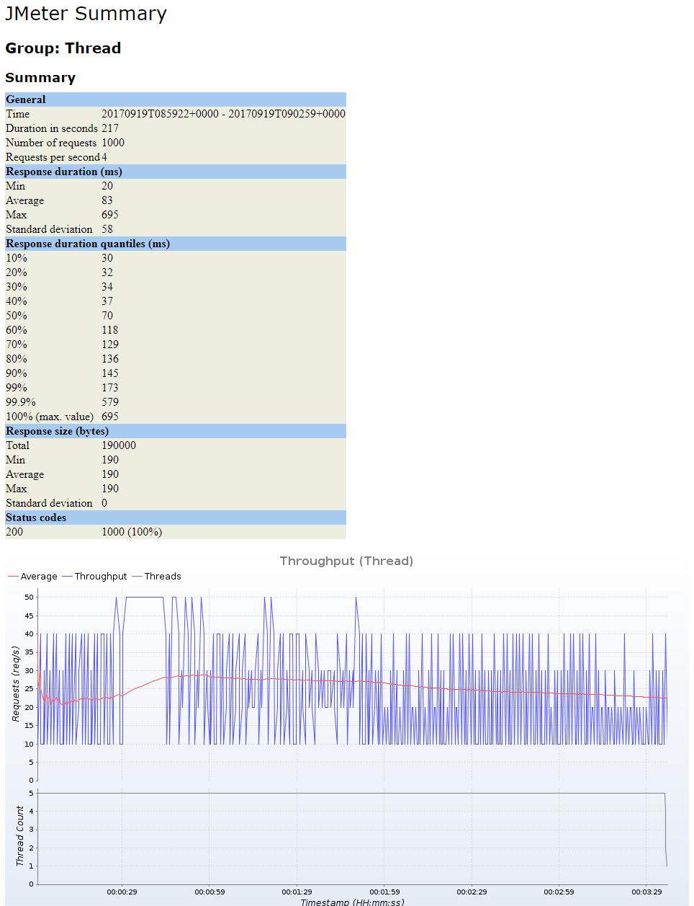
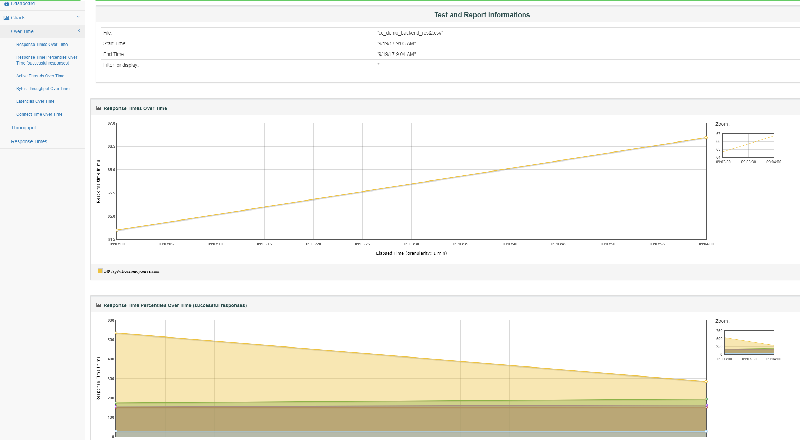
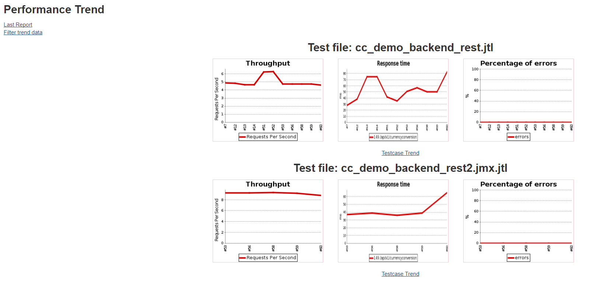

# executePerformanceJMeterTests

## Description

Execute jmeter test with docker for component, e.g. REST API, micro-service. Details on tools and how to create JMeter script can be found [UI-less component test](https://wiki.wdf.sap.corp/wiki/display/IndCldHCP/Performance+Test+Tools#PerformanceTestTools-UnitandUI-lesscomponentperformancetesttoolscomparison).

## Prerequisites

JMeter test scripts need to be developed and triggered through maven project. An example of JMeter script with corresponding maven project structure can be found [here](https://github.wdf.sap.corp/IndustryCloudFoundation/cc-demo-backend-performancetests)

## Example

```groovy hl_lines="1"
    executePerformanceJMeterTests script: this
    publishTestResults(jmeter: [archive: true], allowUnstableBuilds: false)
```

## Available Testing Environment

Currently there are two options from where the JMeter test can be triggered.

- Run test on Docker or Kubernetes:  this is the default value. The JMeter tests will be triggered from Docker (if Jenkins is on e.g. Monsoon) or Kubernetes (if Jenkins is on JaaS), and certain network latency is expected.
- Run test from within Cloud Foundry via JDroid: JMeter tests will be triggered from [your own JDroid instance](https://github.wdf.sap.corp/ContinuousDelivery/JDroid) which resides inside Cloud Foundry. This option offers the least network latency to your CF application.

Use parameter `testTool` to determine which testing environment to use.

## Parameters

| parameter | mandatory | default | possible values |
| ----------|-----------|---------|-----------------|
|script|yes|||
|dockerCommand|no|`/bin/bash /opt/selenium/start_mvn verify -Dtest.hostname=${config.testServerUrl} ${config.testOptions}`||
|dockerEnvVars|no|||
|dockerImage|no|`docker.wdf.sap.corp:50000/piper/performance`||
|dockerVolumeBind|no|`[/dev/shm:/dev/shm]`||
|dockerWorkspace|no|`/home/piper`||
|failOnError|no|`false`||
|gitBranch|no|||
|gitSshKeyCredentialsId|no|``||
|jdroidUrl|yes|`https://jdroid.cfapps.sap.hana.ondemand.com`||
|perfJMeterTestPath|no|testTool=`container`: `./`<br />testTool=`jdroid`: ``<br />||
|stashContent|no|<ul><li>`buildDescriptor`</li><li>`tests`</li></ul>||
|testOptions|no|``||
|testRepository|yes|||
|testServerUrl|yes|||
|testTool|no|`container`|`container`, `jdroid`|

### Details

- Configure perfJMeterTestRepository (please use https git url) and perfJMeterTestUrl per your scenario, e.g.:

```yml
steps:
  executePerformanceJMeterTests:
    testServerUrl: 'https://icf-performance-currency-exchange-rates-services.cfapps.sap.hana.ondemand.com'
    testRepository: 'https://github.wdf.sap.corp/IndustryCloudFoundation/cc-poc-currency-rates-core-pt.git'
```

- Actual test will be executed within executePerformanceJMeterTests()
- With `failOnError` you can define the behavior, in case tests fail. When this is set to `true` test results cannot be recorded using the `publishTestResults` step afterwards.
- Use perfJMeterTestPath, if JMeter tests are located in a subfolder of the given repository
- In case the test implementation is stored in a different repository than the code itself, you can define the repository containing the tests using parameter `testRepository` and if required `gitBranch` (for a different branch than master) and `gitSshKeyCredentialsId` (for protected repositories). For protected repositories the `testRepository` needs to contain the ssh git url.
- `jdroidUrl` required if testTool is set to `jdroid`. Deploy your own instance of [JDroid](https://github.wdf.sap.corp/ContinuousDelivery/JDroid)
- You can influence how JMeter is called in the `container` case:

  - you can append additional parameters by setting parameter `testOptions`
  - you can influence the complete Maven call by setting parameter `dockerCommand`

!!! hint "Passing credentials to the test"

    We recommend to use parameter `dockerEnvVars` to pass parameters as environment variables into the container executing JMeter. The test script can then access the environment variables and retrieve the values. Alternatively, you could use `testOptions` to pass parameters directly to the JMeter execution.

## Step configuration

We recommend to define values of step parameters via [config.yml file](../configuration.md).

In following sections the configuration is possible:

| parameter | general | step | stage |
| ----------|-----------|---------|-----------------|
|script||||
|dockerCommand|X|X|X|
|dockerEnvVars|X|X|X|
|dockerImage|X|X|X|
|dockerVolumeBind|X|X|X|
|dockerWorkspace|X|X|X|
|failOnError|X|X|X|
|gitBranch|X|X|X|
|gitSshKeyCredentialsId|X|X|X|
|jdroidUrl|X|X|X|
|perfJMeterTestPath|X|X|X|
|stashContent|X|X|X|
|testOptions|X|X|X|
|testRepository|X|X|X|
|testServerUrl|X|X|X|
|testTool|X|X|X|

## Available Reports

Currently this step supports three types of test reports:

### 1. [JMeter Analyzer Maven plugin report](https://github.com/afranken/jmeter-analysis-maven-plugin)


___

### 2. [JMeter built-in dashboard report](http://jmeter.apache.org/usermanual/generating-dashboard.html)


___

### 3. [Performance Trend report by Jenkins performance plugin](https://wiki.jenkins.io/display/JENKINS/Performance+Plugin)



### Code examples  to generate different reports

Example 1: Generate Jmeter Analyzer Maven plugin report

```groovy
    publishTestResults jmeter: [archive: true], allowUnstableBuilds: false
```

Example 2: Generate both Jmeter built-in dashboard and Jmeter Analyzer Maven plugin report

```groovy
    publishTestResults jmeter: [archive: true, dashboardReport: true], allowUnstableBuilds: false
```

Example 3: Fail build automatically based on predefined absolute threshold

```groovy
    publishTestResults jmeter: [archive: true, errorUnstableThreshold: 10, errorFailedThreshold: 20, errorUnstableResponseTimeThreshold: "testPlan.jtl:2000"], allowUnstableBuilds: false
```

Above example will set the build as UNSTABLE if there are more than 10% of error requests,  or FAILURE if more than 20% error requests.  Additionally if average response time is more than 2000ms, the build will be set to UNSTABLE.

Example 4: Fail build automatically by comparing with previous successful build using relative threshold

```groovy
publishTestResults jmeter: [archive: true, modeOfThreshold: true, relativeFailedThresholdPositive:60, relativeFailedThresholdNegative:60, relativeUnstableThresholdPositive: 40, relativeUnstableThresholdNegative: 40], allowUnstableBuilds: false
```

Above example will set the build to UNSTABLE if average response time is outside (-40%, +40%) of previous successful build, or FAILURE if outside of (-60%, +60%)

By default Performance Trend report by Jenkins Performance Plugin is always generated.

Please note that Jmeter Maven Plugin needs to be [version 2.2.0 to support Jmeter built-in dashboard report](https://github.com/jmeter-maven-plugin/jmeter-maven-plugin/issues/208).    Example of pom.xml file can be found [here](https://github.wdf.sap.corp/IndustryCloudFoundation/cc-demo-backend-performancetests/blob/master/pom.xml).
