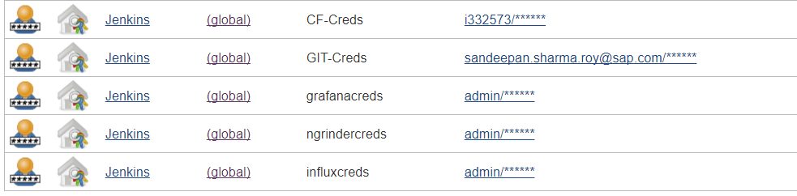
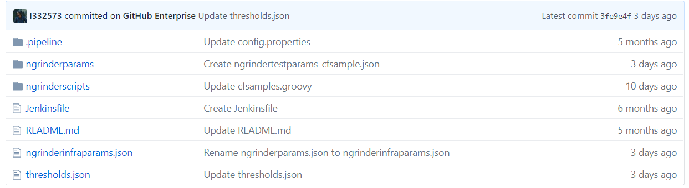
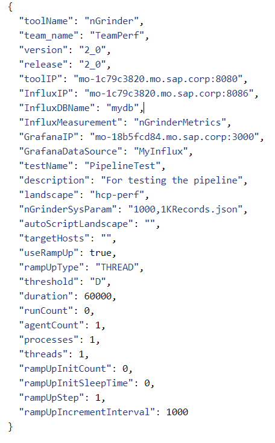
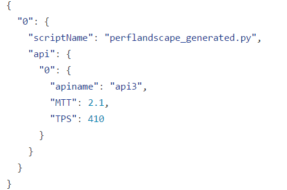
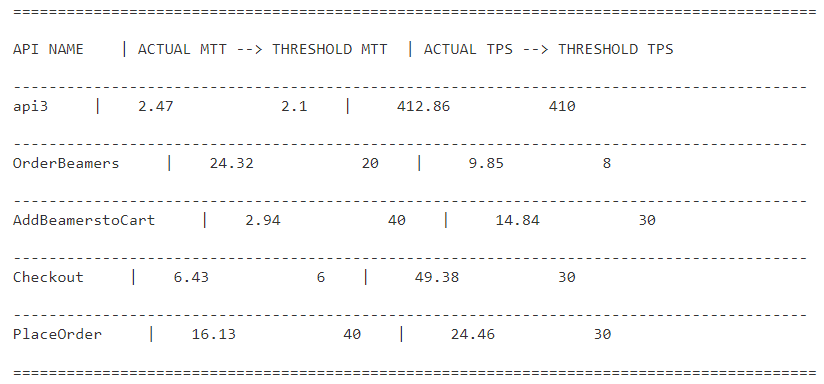
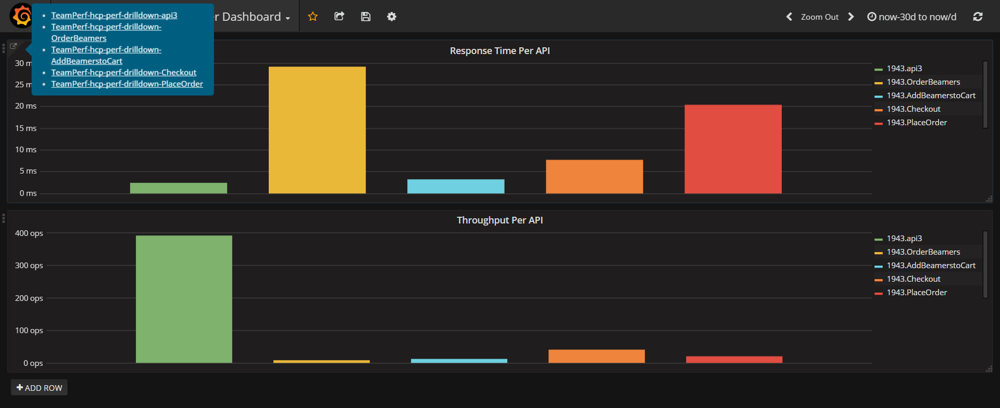
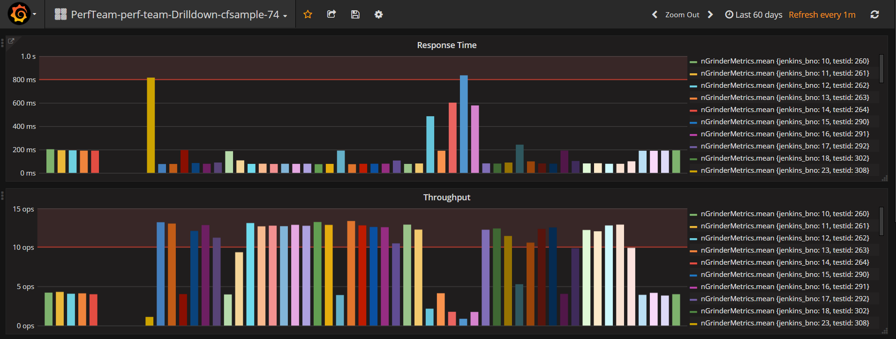
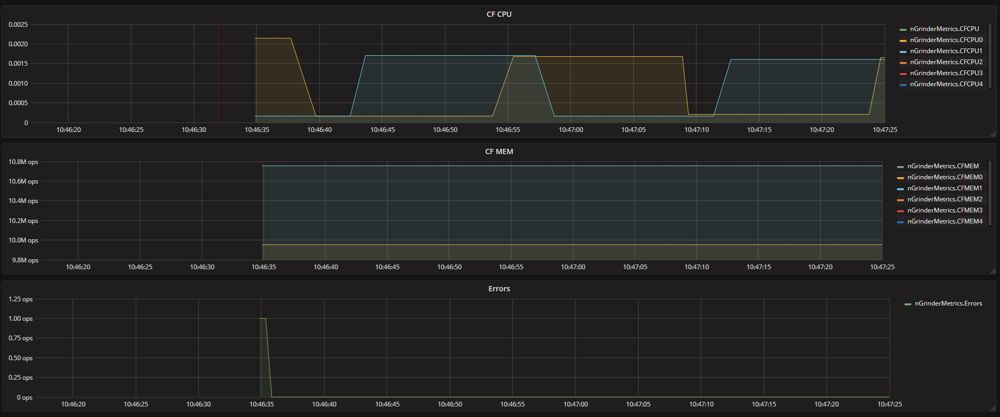

# executePerformanceNGrinderTests

## Description

Execute Ngrinder tests with docker for component. Execution of scripts and installation of prerequisites take place inside the docker container.

## Prerequisites

- cfMetrics is required, whether we have to monitor CF application resources like CPU and memory.
- Cloud Foundry organization,Space and App GUID is required if you give `true` to cfMetrics and if application is deployed in the CF.
- Credentials for CF, InfluxDb,Grafana and nGrinder to be taken from Jenkins.
- JAAS Instance

  

## Example

   Usage of the pipeline step

```groovy
executePerformanceNGrinderTests script: this
```

## Parameters

| parameter | mandatory | default | possible values |
| ----------|-----------|---------|-----------------|
|script|yes|||
|cfMetrics|yes|true||
|cfApiEndpoint|no|`https://api.cf.sap.hana.ondemand.com`||
|cfAppGuid|Yes if `cfMetrics` is true|||
|cfCredentialsId|Yes if `cfMetrics` is true|||
|cfOrg|Yes if `cfMetrics` is true|||
|cfSpace|Yes if `cfMetrics` is true|||
|dockerImage|no|`docker.wdf.sap.corp:50000/piper/ngrinder`||
|dockerWorkspace|no|`/home/piper`||
|grafanaCredentialsId|yes|||
|influxCredentialsId|yes|||
|ngrinderCredentialsId|yes|||
|stashContent|no|<ul><li>`buildDescriptor`</li><li>`tests`</li></ul>||

## Step configuration

We recommend to define values of step parameters via [config.yml file](../configuration.md).

In following sections the configuration is possible:

| parameter | general | step | stage |
| ----------|-----------|---------|-----------------|
|script||||
|cfMetrics|X|X|X|
|cfApiEndpoint|X|X|X|
|cfAppGuid|X|X|X|
|cfCredentialsId|X|X|X|
|cfOrg|X|X|X|
|cfSpace|X|X|X|
|dockerImage|X|X|X|
|dockerWorkspace|X|X|X|
|grafanaCredentialsId|X|X|X|
|influxCredentialsId|X|X|X|
|ngrinderCredentialsId|X|X|X|
|stashContent|X|X|X|

## Details

**Introducing nGrinder as a part of the pipeline:**



<!-- markdownlint-disable-next-line MD036 -->
**Existing Setup**

Artifacts required include:

1.**ngrinderinfraparams.json**: Consists of the infra parameters for Performance test. The parameters within this file may vary from version to version depending upon the features but the function remains the same. This parameters file will contain all the ip's of the various tools and the relevant infra parameters needed for the execution of the pipeline.

  

Generic Parameter Explanation:

- **toolName**: Tool being used for the Performance test, in this case, leave it as nGrinder (case sensitive) *
- **team_name**: The name of the team using the service - will be used for Grafana dashboard creation *
- **landscape**: Name of the landscape file used for auto-generation of GET nGrinder scripts (accepts comma separated values)
- **version**: Version of the current code/application  (if none exists, use any versioning value) *
- **release**: Release of the current codea/application (if none exists, you can put the same value as version) *
- **toolIP**: IP address:port of nGrinder *
- **InfluxIP**: IP address:port of persistence end-point *
- **GrafanaIP**: Hostname:port of Grafana *

P.S: If your tools are deployed in a monsoon VM, it is always encouraged to write the IP's in the mo-hash format(mo-xxxxx.mo.sap.corp:xxxx) as shown in the above image.

2.**ngrinderparams** : Every ngrinder scripts that has to be executed might require its own set of test parameters. Multiple scripts might require different configurations for execution. This folder will contain json files with different values of the test parameters that the user can choose from for their performance tests.

_nGrinder Test Parameter Explanation:_

- **testName**: Name given to the performance test to be conducted by nGrinder *
- **description**: Test description
- **useRampUp**: Whether you would like the test to ramp up load of virtual users or directly begin with a given load *
- **targetHosts**: Any target machine IP which has to be monitored. Note: This is different from the API on which you'd like to conduct the performance test for
- **threshold**: End condition for test - Enter D for duration and R for runcount *
- **duration**: Time duration of the test in milliseconds (only if threshold value is provided as D, else blank) *
- **runcount**: Runcount of the test (only if threshold is provided as R, else blank) *
- **agentCount**: The agents are the ones that spawn virtual users (refer [architecture](http://www.cubrid.org/wiki_ngrinder/entry/general-architecture) for more information). This parameter defines the number of agents used for a test
- **processes**: Number of processes to be spawned *
- **threads**: Number of threads each process will run *
  - _Number of virtual users spawned is calculated as: processes * threads_
- **rampUpInitCount**: Initial count of virtual users before ramp-up *
- **rampUpInitSleepTime**: Initial sleep time before ramp-up begins
- **rampUpStep**: Number of virtual users spawned per incremenent interval *
- **rampUpIncrementInterval**: Milliseconds after which ramp up should occur *

    <!-- markdownlint-disable-next-line MD036 -->
    _All parameters followed by a star are required_

3.**thresholds.json**: This json file would contain the name of the scripts to be executed, along with their corresponding api's,test parameter file from the ngrinderparams folder and the respective threshold values of their KPI's. After the tests have been run, a table is generated that would compare the actual values and the threshold values and therefore notify us when an anomaly has occurred.

  

 Sample thresholds table:

  

4.**ngrinderscripts**:   This folder contains scripts and json file for running a performance test. Scripts in nGrinder are to be written  either in Jython or Groovy.

5.The '**runPerformancenGrinderTests**' flag has been introduced in the existing config.yml file. nGrinder Test can be run only if the flag is set to true.

6.**executePerformancenGrinderTests library test** introduced in the pipeline provides nGrinder as an option alongside Jmeter. A **released version** of a shell script present in a docker image is being utilized that extracts the variables from the ngrinderparams.json and thresholds.json uses them to run an nGrinder test, pushes the data into InfluxDb and visualizes the test results in Grafana.

**nGrinder as a tool:**

nGrinder is a distributed load testing framework.Testing your applications using nGrinder in the CI Pipeline requires installation of nGrinder.

Features of nGrinder includes:

- Lightweight with framework developed in JAVA.
- Uses Jython and Groovy to create test scenarios.
- Distributive nature - Controllers and scalable Agents.
- Can run multiple tests concurrently.
- Works on any hardware platform that supports java.
- Web-based UI for project management, monitoring, result management and report management.
- Can run multiple tests concurrently.
- Capabilities include Load testing, Capacity testing, Functional and Stress testing.
- Powerful REST Api's.

Official installation of nGrinder controller and agents can be found [here](https://naver.github.io/ngrinder/).

However, if you'd like to read our own in-house guide (provided with our own custom scripts), you can find that too, [here](https://jam4.sapjam.com/blogs/show/FQyWfwRZDAOCnQAuQKn3p8).

Furthermore, You can find our team's best practices with nGrinder [here](https://jam4.sapjam.com/wiki/show/1ciwlyNECTPGryGDSaFSZ2).

<!-- markdownlint-disable-next-line MD036 -->
**Persistence and Visualisation**

InfluxDB is a time-series database that is currently supported as part of the pipeline. We use InfluxDB to persist all the metrics pushed by our performance tools. Grafana is used to visualize the data stored in the persistence.

<!-- markdownlint-disable-next-line MD036 -->
**Deploying own InfluxDB and Grafana**

1.**InfluxDB**

InfluxDB has good documentation, we recommend following that. You can find that [here](https://docs.influxdata.com/influxdb/v1.2/introduction/installation/).

2.**Grafana**

Grafana is an open source metric analytics & visualization suite which we use to stream live nGrinder test data. For installation, You can find the link [here](https://github.wdf.sap.corp/EngSrv-Performance/PerformancePipeline/blob/v1.3/README.md)

  <!-- markdownlint-disable-next-line MD036 -->
  **Current Grafana Setup**

  After the test has been executed and data has been pushed to the InfuxDb, dashboards will be created ingrafana accordingly.
  For a particular test, three types of dashboards will be created. The **Master** dashboard will containthe mean metric values of the latest test for all the individual API's. Accordingly, the **Drilldown**dashboard for a particular api/transaction will give you the trend of how its been behaving over a periodof time.The **Final** Drilldown dashboard gives a much more accurate description of the KPI's for theduration of the test.

  **Master dashboard:**

  

  **Drilldown dashboard:**

  

  **Third dashboard:**

  

For more information, please visit the [official Grafana Documentation](http://docs.grafana.org/).
