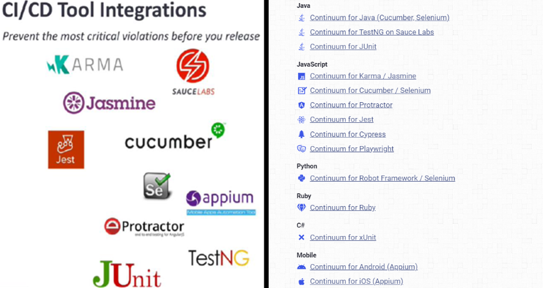
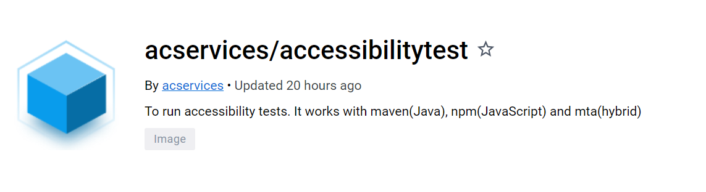
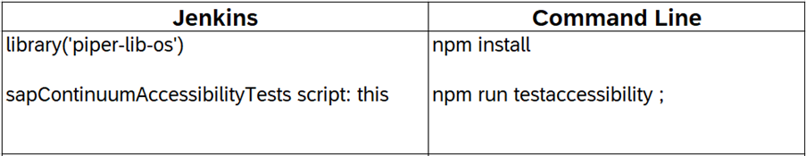
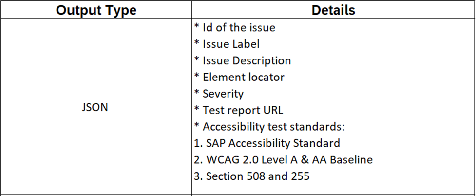
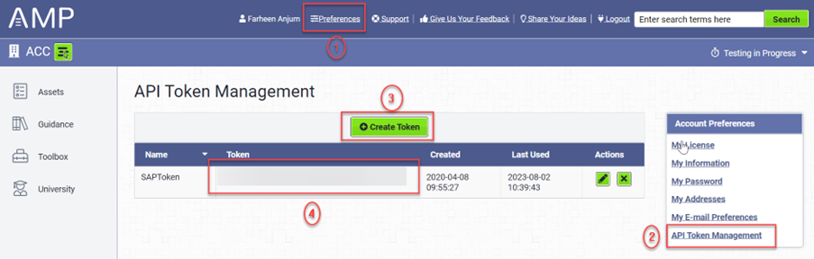

# ${docGenStepName}

## ${docGenDescription}

## Automation & Build Tools Supported by Access Continuum

The test engine comes in an injectable format that is agnostic to _Java_, _JavaScript_, _Python_ & _Mobile framework_ used. Ties easily into the existing test harness and tools.

Access Continuum SDKs are available in different programming or scripting languages supported by different test automation tools such as:

* Selenium/Cucumber (Java)

* TestNG/Sauce Labs (Java)

* JUnit (Java)

* Karma/Jasmine (JavaScript)

* Selenium/Cucumber (JavaScript)

* Protractor (JavaScript)

* Jest (JavaScript)

* Cypress (JavaScript)

* Playwright (JavaScript)

* Robot Framework/Selenium (Python)

* Ruby (Ruby)

* xUnit (C#)

* Android (Appium - Mobile)

* iOS (Appium - Mobile)

Access Continuum SDKs are available in different languages supported by different build tools which are listed below:

* Maven

* Node (NPM)

* MTA (Hybrid)

* Gradle

Access Continuum SDKs are only for web-based UI testing. It supports below listed cross-browser testing:

* Chrome

* Firefox

* Safari

* Edge

 

## Docker Image

Currently the underlying [Docker image](https://github.wdf.sap.corp/accessibility/Selenium-Docker-Image) is public and specific to the ‘Node for JavaScript’ based projects and therefore may have to be configured to fit and support the relevant scenario.

Docker image is created for accessibility which contains following details:

* Chrome browser

* Node for JavaScript based projects.

* Access Continuum support files

 

## Usage

Access Continuum is a third-party tool, and it is provided by Level Access located in United States. Accessibility Management Platform has a dashboard which can be access using this URL - AMP URL where user can see the reports generated from Access Continuum code.

We recommend to define values of step parameters via .pipeline/config.yml file.

In this case, calling the step is essentially reduced to defining the step name.
Calling the step can be done either in an orchestrator specific way (e.g. via a Jenkins library step) or on the command line.

To run accessibility tests for any screen, update the command from ‘test’ to ‘testaccessibility’ under scripts scope in project’s package.json file. Also in your test case file trigger the access continuum test as per steps provided [here](https://wiki.one.int.sap/wiki/pages/viewpage.action?pageId=3380188814#:~:text=in%20AMP%20dashboard.-,Getting%20Started%20with%20Access%20Continuum,-Standard%20Access%20Continuum).

 

## Outputs

Access Continuum test results are available in JSON format which is displayed in key – value pair including accessibility violation description, element locator present in the DOM structure, severity of the issue, test report URL and SAP accessibility test standards against the results are displayed on the terminal.



## Prerequisites

* SAP has a licensed or registered account with Level Access [AMP]. We have enterprise version unlimited user license; Access Continuum SDKs can be directly consumed by different development units within an organisation.

* For AMP user creation, please contact – `DL SAP AMP User Access`.

* For AMP API token creation, below are the detailed steps:
  * Login into AMP dashboard URL - `https://sap.levelaccess.net/` with SAP Email-Id as username and the password set by user and then navigate to the Asset.
  * Step-1: Activate “Preferences” link from header, ‘Preferences Home’ screen will appear.
  * Step-2: Activate “API Token Management” link from ‘Account Preferences’ section, ‘API Token Management’ screen will appear.
  * Step-3: Activate “Create Token” button, dialog appears.
  * Step-4: Provide token label in the ‘Name’ field and then activate “Submit” button. A unique autogenerated alphanumeric string is created for user.
  * Final Step: Pass the autogenerated token in ‘continuum.json’ file for report generation.

## Further Links

Further accessibility automation specific documentation/wiki URLs:

* It allows user to validate Accessibility violations using tool, authorization token is used which will verify the authenticity of the end-user and allow user to generate reports within AMP dashboard. Jenkins credentials (secret text) has been used to input AMP API token.

* [Accessibility Automation (Access Continuum) Wiki](https://wiki.one.int.sap/wiki/pages/viewpage.action?pageId=3380188814)

* [Accessibility Testing Wiki](https://sap.sharepoint.com/sites/206175?xsdata=MDV8MDF8fDMyYTljMmVkOTA3NTQwNmVlOWE3MDhkYjgzNWNhMmZmfDQyZjc2NzZjZjQ1NTQyM2M4MmY2ZGMyZDk5NzkxYWY3fDB8MHw2MzgyNDgyMDYwOTc5Njc1Mjd8VW5rbm93bnxWR1ZoYlhOVFpXTjFjbWwwZVZObGNuWnBZMlY4ZXlKV0lqb2lNQzR3TGpBd01EQWlMQ0pRSWpvaVYybHVNeklpTENKQlRpSTZJazkwYUdWeUlpd2lWMVFpT2pFeGZRPT18MXxMMk5vWVhSekx6RTVPbTFsWlhScGJtZGZXVlJqTUZwdFVtMVpla0YwV1ZkUmVFMVRNREJPVjBacVRGZEdiVnBFV1hST2FtdDNUMGRaTTAxWFVtcGFSMWswUUhSb2NtVmhaQzUyTWk5dFpYTnpZV2RsY3k4eE5qZzVNakl6T0RBNU16QTR8MDMyYTNlYWE3NjljNDUyNGU5YTcwOGRiODM1Y2EyZmZ8NWM0ODNiMTFkYTg1NDNlOWIxY2QxOTk1MzNjMmI1ZGI%3D&sdata=Z0FVQzcreURXTEVPRmNtZUhSOWdDYWFhTkV0MzZvTnpISjBYM1JpdVBMWT0%3D&ovuser=42f7676c-f455-423c-82f6-dc2d99791af7%2Cfarheen.anjum%40sap.com&OR=Teams-HL&CT=1689224226136&clickparams=eyJBcHBOYW1lIjoiVGVhbXMtRGVza3RvcCIsIkFwcFZlcnNpb24iOiIyNy8yMzA2MDQwMTE2MSIsIkhhc0ZlZGVyYXRlZFVzZXIiOmZhbHNlfQ%3D%3D)

* [Access Continuum [AMP] Known Issues](https://wiki.one.int.sap/wiki/display/UI/AMP+tool+issues)

* [Access Continuum [AMP] Support](https://support.levelaccess.com/hc/en-us/categories/360001290651)

* [Accessibility Criteria Coverage](https://wiki.one.int.sap/wiki/display/ATL/Accessibility+Test+Automation)

## ${docGenParameters}

## Details

`token`

User needs to generate a unique API token for report generation in AMP dashboard. It is used to verify the authenticity of the end-user and allow user to generate reports within AMP dashboard. Jenkins credentials (secret text) can be used to input AMP API token.

This token is used to access AMP dashboard portal. It can be stored as a Jenkins 'Secret text' credentials ID containing token to authenticate to AMP dashboard portal.

<!-- markdownlint-disable-next-line MD036 -->
**back to overview**



## ${docGenConfiguration}

## Exception

none

## Example

To run the accessibility step, developers can follow the below example. This format can be given in the Jenkinsfile.

Example:

```groovy
sapAccessContinuumExecuteTests script: this,
  buildTool: 'npm',
  token: 'apitokenDemo',
  runCommand: 'folderName'
```
