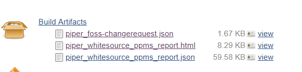
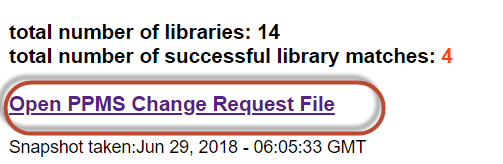

# ${docGenStepName}  

## ${docGenDescription}

## Further information

Basically, this pipeline step uses the scan results of your development project in WhiteSource and BlackDuck and maps this information to the corresponding declarations in PPMS. This step fetches registered libraries and verifies that for direct dependencies the suitable PPMS Freeware and Open Source (FOSS) entries are declared.

- The WhiteSource entries can be generated automatically with the Piper step [whitesourceExecuteScan](whitesourceExecuteScan.md).
- The BlackDuck entries are generated automatically with the Piper step [detectExecuteScan](detectExecuteScan.md).

**In any case a previous scan of your development project is a pre-condition for this step.**

The comparison of this PPMS check step will generate an HTML report and additionally output its data in json format. If the FOSS declaration lacks any actually used libraries the build will fail in this step unless the automatic PPMS update is activated. **It is highly recommended to do so**.
The check is executed against a PPMS Software Component Version (including Build Versions).

!!! success "PPMS Compliance"
    PPMS compliance is one of SAP's corporate requirements which needs to be fulfilled for any product delivery.
    This step helps you to cross-check your compliance, and it reduces the manual activities for creating the model of your delivery in PPMS as good as possible.

!!! info "Recommendation: PPMS automation"
    It is possible to automatically update an existing Software Component Version / Build Version in the PPMS system and thus avoid any manual interventions.

    Direct upload of _PPMS Change Request file_ to PPMS via the new PPMS upload functionality. Please check [PPMS Wiki - SCV - Automated Update of Comprised FOSS via API](https://wiki.wdf.sap.corp/wiki/x/wwEwf) for further details. You will find there the required configuration on PPMS-side to enable this functionality. **Make sure to activate the upload by setting the configuration** `ppmsChangeRequestUpload: true`.

    **Please note:**

    **Upload to PPMS will only happen if a new FOSS (version) was found in the scan** which is not yet part of the PPMS Software Component Version (Build Version). This means:

        1. No upload to PPMS: if in the PPMS Software Component Version (Build Version) all found FOSS AND additional FOSS are contained.
        2. Additional FOSS will only be removed from the PPMS Software Component Version (Build version) once a new FOSS (version) is identified.

    Automatic creation of a PPMS build version:
    Activation in Piper is done using the configuration parameter [`createBuildVersion`](#createbuildversion).

    You have two options for creating build versions:

    1. Create a build version with a fix name by using for example the following configuration `ppmsBuildVersion: 'MY BV NAME'`
    2. Create build versions based on a template. By default the following template is used `\${version.major}.\${version.minor}.\${version.patch}`

    You find further details in the [Parameters](#parameters) section below.

    For details on the activation on PPMS side, see: [Enable an SCV in PPMS for Automated Creation of newest Build Version](https://wiki.wdf.sap.corp/wiki/x/B4VjfQ).

## Prerequisites

This pipeline step can only be executed successfully if you have done the following activities in advance:

### Credentials for PPMS system

#### Technical user (recommended)

See: CV Part in [PPMS Wiki](https://wiki.wdf.sap.corp/wiki/x/9SQwf).

#### Named user

Create a credential entry (with type username and password) in your Jenkins with your I7P username and password. If you are unsure about how to create credential entries in Jenkins, you find further information in the [Jenkins documentation](https://jenkins.io/doc/book/using/using-credentials/).

**This ensures that your password is stored securely in your Jenkins system.**

!!! hint "Hint: How to enable basic authentication for your PPMS-user"
    To enable the setting of the password in system I7P you need to get your D-/I-User enabled for manual logon to the system by creating a service request ticket. To create the Ticket go to the [SMO Service Catalogue](https://sap.sharepoint.com/sites/125708/SitePages/Service-Catalogue.aspx) and select category `SMOSUSY006 - Enable user/password login - disable SNC` to create a new ticket (see also [note 2482576](https://i7p.wdf.sap.corp/sap/support/notes/2482576)).

Use the following sample text for the ticket and replace with the `D-/I-User` of your Jenkins Admin):

- User ID: `<D-/I-User>`
- System ID: I71 and I72
- issue description / error message: User needs to be able to authenticate with User/Password to be able to automatically provide Change Requests to PPMS
- application/scenario/process working with/for: Change Requests for SW Component Versions in PPMS

!!! hint "Hint: How to get a password for your PPMS-user"
    You need to know the I7P-password of the D-/I-User of your team's Jenkins Admins to be able to connect to PPMS via REST (note: this should not be your global PW); and in addition the D-/I-User needs to be enabled for manual logon to the PPMS-system (by default Single Sign On is mandatory for access to system I7P). In case you don't remember your I7P-password you can reset it using the [Self-Service](https://uap.bss.net.sap/sap/bc/webdynpro/sap/yupa_pw_self_service#).
    Then you need to logon to System I7P (using SAPLogon and the reset PW) and set initially a new password here. After you have done this you can use your D-/I-User and the password as credentials in your Jenkins. If you skip this one-time logon to I7P step the password will expire very frequently. **Note:** You need to reset the password manually in both backend systems of I7P. The backend systems are I71 and I72. Make sure to logon manually to both of them and set the same password in each of them (I7P will direct you to one of them and in addition you need to logon to the other one as backend systems are switched frequently).

If you don't have an entry for system I7P in your SAPLogon yet make sure to select _Activate Secure Network Communication_ checkbox and leave the _SNC-Logon with user/PW_ unselected in the settings.

Recommendation is to have at least two colleagues of your team acting as team admins and both should ensure the PPMS-access for their D-/I-User. **Also do not use D-I-Users with PPMS entry owner permissions** to have users with minimal permissions only.

### Whitesource

#### Project with productToken

Supply the productToken as part of the step configuration via `whitesourceProductToken` to allow us exact identification of your project when inquiring and retrieving data from the WhiteSource backend service.

#### Project with fix version number

Please refer to the section _Make sure to create WhiteSource projects with dedicated version numbers_ in the documentation of the step [whitesourceExecuteScan](whitesourceExecuteScan.md).

### BlackDuck Hub

Please follow the information in the [BlackDuck Work Zone group](https://workzone.one.int.sap/site#workzone-home&/groups/IkjN0Yvx8okwEHVmsixFMc/workpage_tabs/ajslrilwXb3YWKBoZpWH6r) for creating a group and getting a token.

### SAP FOSS

!!! note "SAP FOSS Validation Process"
    General information on the FOSS process is available on the Why&How page of the corresponding task in Sirius and on the [product Standard Licensing-Wiki](https://wiki.wdf.sap.corp/wiki/display/glwikilc/Product+Standard+Licensing).

## ${docGenParameters}

## ${docGenConfiguration}

## Results and related activities

If you have implemented this step correctly you should find the following reports in your Jenkin's Build Archive:

The `piper_whitesource_ppms_report.[html|json]` contains the results of the Whitesource Scan. If this report is missing in your Build Archive the step is not implemented correctly. The file's exact name may differ as you can overwrite the default with another name using the corresponding step's parameter (see above table of available parameters).

The `piper_foss-changerequest.json` file will be created if the pipeline step identified unmapped FOSS components (i.e. dependencies in your development project which are not listed in the corresponding model in PPMS). You can use this file to get the missing components in PPMS created. Details are described on the [PPMS Wiki](https://wiki.wdf.sap.corp/wiki/pages/viewpage.action?pageId=1956705743).

For your convenience the `piper_foss-changerequest.json` file is also linked directly in the `piper_whitesource_ppms_report.html`:

