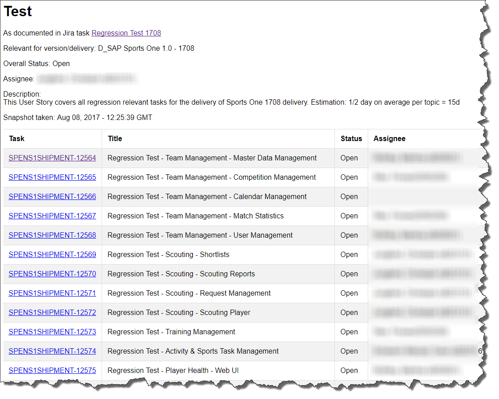

# sapJiraWriteTaskStatus

## Description

This task will assist you to persist the information of a Jira task/issue into an html file.

!!! hint
    One usage example for this step is to maintain in Jira one task (incl. sub tasks) for testing.

    With this step a test report can be created based on this Jira task. This report can then be uploaded automatically to Sirius using the step [siriusUploadDocument](siriusUploadDocument.md).

## Prerequisites

You need to have a user for accessing Jira.

Its username and password have to be maintained in the Jenkins credentials store.

**Recommendation is to use a technical user instead of your SAP GLOBAL account:**

In order to get a technical user please create an issue in the [JIRAADMIN project](https://sapjira.wdf.sap.corp/secure/IssueHierarchyOverview!default.jspa?projectKey=JIRAADMIN&displayMode=hierarchy).
Please use component _technical user_ and take one of the previous requests as sample.

## Example

Usage of pipeline step:

```groovy
sapJiraWriteTaskStatus script:this,
                        credentialsId: 'myJiraCredentialsId',
                        issueKey: 'SPENS1SHIPMENT-12563',
                        reportTitle: 'This is my report title',
                        fileName: 'test.html'
```

## Parameters

| parameter | mandatory | default | possible values |
| ----------|-----------|---------|-----------------|
|script|yes|||
|fileName|no|`taskStatus.html`||
|jiraApiUrl|no|`https://sapjira.wdf.sap.corp/rest/api/2`||
|jiraCredentialsId|yes|||
|jiraIssueKey|yes|||
|reportTitle|no|`Jira Task Status`||
|style|no|||

### Details

* `script` defines the global script environment of the Jenkinsfile run. Typically `this` is passed to this parameter. This allows the function to access the [`globalPipelineEnvironment`](../objects/globalPipelineEnvironment.md) for retrieving e.g. configuration parameters.
* Jira credentials id in Jenkins is defined with `jiraCredentialsId`.
* `jiraIssueKey` defines the key of the Jira issue, e.g. `SPENS1SHIPMENT-12563`
* The Jira API url is defined with `jiraApiUrl`. You may want to use a different Jira system than the SAP default one.
* With `reportTitle` you define the title of the generated html document as well as the headline of the document
* The generated html document is stored with the name `fileName`
* For css styling of the document a custom style can be used. The custom css is passed as text via the `style` parameter. The default style can be found in the file [piper.css](https://github.wdf.sap.corp/ContinuousDelivery/piper-library/blob/master/resources/piper.css)

## Step configuration

We recommend to define values of step parameters via [config.yml file](../configuration.md).

In following sections the configuration is possible:

| parameter | general | step | stage |
| ----------|-----------|---------|-----------------|
|script||||
|fileName|X|X|X|
|jiraApiUrl|X|X|X|
|jiraCredentialsId|X|X|X|
|jiraIssueKey|X|X|X|
|reportTitle|X|X|X|
|style|X|X|X|

## Example output


