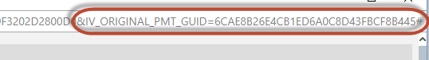

# siriusUploadDocument

## Description

This step allows you to upload documents to a [Sirius](https://ifp.wdf.sap.corp/sap(bD1lbiZjPTAwMQ==)/bc/bsp/sap/zprs_ui_bsp/index.do#/home) task.

[Sirius](https://ifp.wdf.sap.corp/sap(bD1lbiZjPTAwMQ==)/bc/bsp/sap/zprs_ui_bsp/index.do#/home) is the tool for conducting customer deliveries.
Relevant tasks, especially tasks defined as SAP corporate requirements are tracked in this tool.

For certain tasks it is required to upload documents. This can be automated using this step

!!! note
    The step is based on the Task Documeent upload API documented in the [Sirius API documentation](https://github.wdf.sap.corp/tools/ng-sirius/wiki/APIs#task-document-upload)

## Prerequisites

You need to have a technical user for accessing the Sirius API.

Its username and password need to be maintained in the Jenkins credentials store.

Please create an [ITdirect ticket](https://itdirect.wdf.sap.corp/sap(bD1lbiZjPTAwMSZkPW1pbg==)/bc/bsp/sap/crm_ui_start/default.htm?sap-%20sessioncmd%20=open&saprole=ZITSERVREQU&crm-object-type=AIC_OB_INCIDENT&crm-object-action=D&PROCESS_TYPE=ZINE&CAT_ID=IMFIT_TOOLS_PRG&description=Create%20System%20User%20in%20IF%2A%20Landscape&longtext=Hi%20Colleagues%2C%0A%0APlease%20create%20the%20System%20User%0ARFC_FRM_XXXX%20%5B%20-----%20Please%20keep%20RFC_FRM_%20prefix%20and%20replace%20XXXX%20to%20identify%20your%20new%20technical%20user.%20Delete%20this%20comment%20afterwards%20-------%20%5D%0Ain%20IF%20landscape%20%28IFD%20%2F%20IFQ%20%2F%20IFT%20%2F%20IFP%29%20and%20assign%20following%20roles%0A0000_IFP_CP_SIRIUS_API_READ%0A0000_IFP_CP_SIRIUS_API_WRITE%0A%C2%A0%0AThe%20user%20is%20required%20to%20call%20our%20Sirius%20APIs.%0A%C2%A0%0ABest%20Regards%2C%0A%E2%80%A6) in order to receive a technical user.

## Example

Usage of pipeline step:

```groovy
siriusUploadDocument script: this,
                        siriusCredentialsId: 'mySiriusCredentials',
                        siriusProgramName: 'myProgramName',
                        siriusDeliveryName: 'mySiriusDeliveryName',
                        siriusTaskGuid: '6CAE8B27FCC31ED4BDB5E8374452486B',
                        fileName: 'test.pptx'
```

## Parameters

| parameter | mandatory | default | possible values |
| ----------|-----------|---------|-----------------|
|script|yes|||
|confidential|no|`false`||
|documentName|no|||
|fileName|yes|||
|siriusApiUrl|no|`https://ifp.wdf.sap.corp/zprs/api/v1`||
|siriusCredentialsId|yes|||
|siriusDeliveryName|yes|||
|siriusDocumentFamily|no|`TEST`||
|siriusProgramName|yes|||
|siriusTaskGuid|yes|||
|siriusUploadUrl|no|`https://ifp.wdf.sap.corp/zprs/api/docs/saveDocumentInTask`||

### Details

* `script` defines the global script environment of the Jenkinsfile run. Typically `this` is passed to this parameter. This allows the function to access the [`globalPipelineEnvironment`](../objects/globalPipelineEnvironment.md) for retrieving e.g. configuration parameters.
* Sirius credentials id in Jenkins is defined with `siriusCredentialsId`.
* Define the name of your program in `siriusProgramName`.
* Define the name of your delivery in `siriusDeliveryName`.
* The `siriusTaskGuid` can be retrieved by

    e.g. opening the info page of a task

    

    then check the url of this page and get the value of the `ORIGINAL_PMT_GUID`

    

* The `siriusDocumentFamily` allows you to subsequentially overwrite documents. If you upload the same or a different document with a previously used document family it will overwrite the previously uploaded document. **Please note: this must be a String no longer than 4 characters!**
* The document to be uploaded is defined with parameter `fileName`.
* You can define a dedicated name of the document for Sirius with `documentName`. If not maintained the `fileName` will be used.
* The Sirius API url is defined with `siriusApiUrl`. For testing purposes this could be set for example to the Sirius development system `https://ifd.wdf.sap.corp/zprs/api/v1`.
* During pilot phase the upload api has a different entry point and can be set with `siriusUploadApiUrl` to e.g. the Sirius development system for testing purposes `https://ifd.wdf.sap.corp/zprs/api`.

## Step configuration

We recommend to define values of step parameters via [config.yml file](../configuration.md).

In following sections the configuration is possible:

| parameter | general | step | stage |
| ----------|-----------|---------|-----------------|
|script||||
|confidential|X|X|X|
|documentName|X|X|X|
|fileName|X|X|X|
|siriusApiUrl|X|X|X|
|siriusCredentialsId|X|X|X|
|siriusDeliveryName|X|X|X|
|siriusDocumentFamily|X|X|X|
|siriusProgramName|X|X|X|
|siriusTaskGuid|X|X|X|
|siriusUploadUrl|X|X|X|
