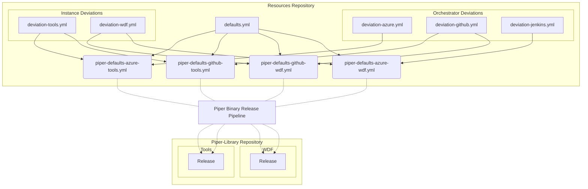

# Piper Resources

This repository holds the resource files needed for the *Piper binary* / *Piper general purpose pipeline*.

## Piper Defaults

The Piper defaults hold the settings that deviate from the general defaults (inside step yml), e.g. for open source step executed in an sap-internal context. These settings are applied to the Piper binary during a *Piper general purpose pipeline* run. Each Piper task (orchestrator specific) should fetch it's specific file that is dependent on the orchestrator it's running on and the GitHub instance that is used.

The settings consist of a general defaults file and *deviation files* for the used orchestrator and GitHub instance. The combination of these three kind of files are located in the `gen/` directory.

if you wish to edit the piper defaults please follow the below rules:´

`/defaults/defaults.yaml` : holds default values that are common to jenkins, azure and github action pipelines . any change in this file will effect all orchestrators

`/defaults/deviation-jenkins.yaml`: holds default values that are applicable to jenkins pipelines only

`/defaults/deviation-azure.yaml`: holds default values that are applicable to azure pipelines only

`/defaults/deviation-github.yaml`: holds default values that are applicable to github action pipelines running on github wdf and github tools instances

`/defaults/deviation-wdf.yaml`: holds default values that are applicable to github action pipelines running on github wdf only

`/defaults/deviation-tools.yaml`: holds default values that are applicable to github action pipelines running on github tools only

once edited , please refer to creating the [generated file(s)](#how-to-make-updates-to-the-defaults) where the final defaults will be created

:bulb: There is no `piper-defaults-jenkins-tools.yml` file as Jenkins always loads it's defaults from the Jenkins library on GitHub WDF.

:bulb: There is no `piper-defaults-azure-wdf.yml` file as it is not possible to use the GitHub WDF instance together with Azure runners.

## How to make updates to the defaults

- Edit the relevant files in the `defaults` folder (as explained in the section above)
- Execute `yarn run build` or `npm run build`, which will generate files in the `gen` folder
  - On windows machine run `yarn run build:windows` or `npm run build:windows`, which will generate files in the `gen` folder . Developed and tested on `git bash` and not other shell emulator in windows.
- Push the files changed in `defaults` and `gen` folders

## How to make updates to the stage config

Simply edit the `stageconfig/piper-stage-config.yml` file.
No file generation needed.
This file is used by all orchestrators.

## When will changes become active?

The defaults and stage config are part of the [Piper release](https://github.wdf.sap.corp/ContinuousDelivery/piper-library/releases), which typically happens on Monday.
Changes will then become active.

The release assets are used directly by Azure DevOps and GitHub Actions.
Jenkins still uses the files in the [piper-library/resources](https://github.wdf.sap.corp/ContinuousDelivery/piper-library/tree/master/resources) folder.
These are automatically updated by the release pipeline as well.
